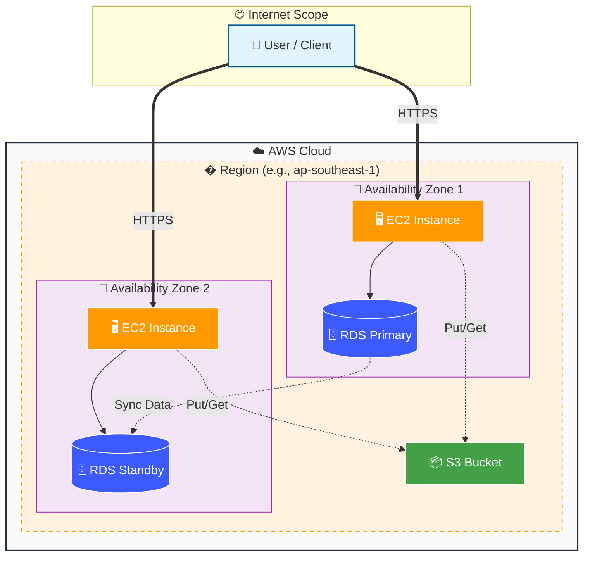
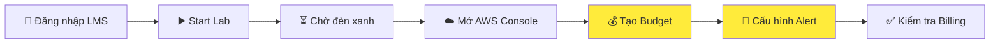
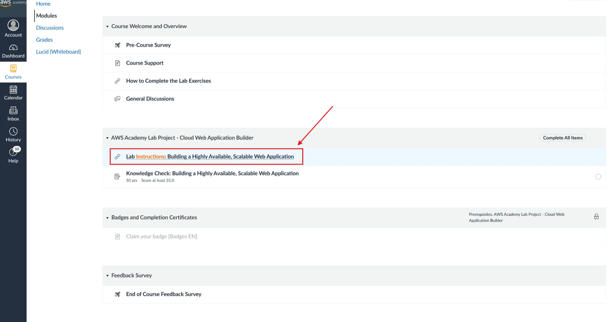
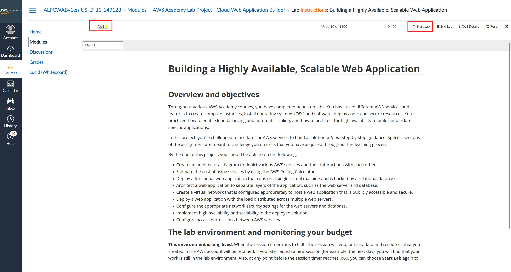
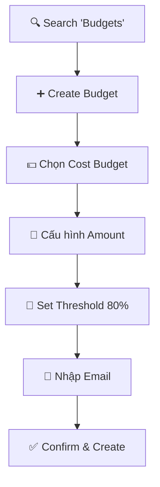

# ☁️ NỀN TẢNG ĐÁM MÂY AWS

> 📅 Ngày học: [12/12/2025]
> 
> 
> ⏱️ **Thời lượng:** ~2-3 giờ (Lý thuyết + Lab)
> 
> 🎯 **Chứng chỉ hướng đến:** AWS Cloud Practitioner / Solutions Architect Associate
> 

---

## 📌 Overview

- **Cloud Computing** là việc thuê hạ tầng IT qua Internet với mô hình **pay-as-you-go** (dùng bao nhiêu trả bấy nhiêu)
- Có **3 mô hình dịch vụ** (IaaS, PaaS, SaaS) và **3 mô hình triển khai** (Cloud, On-premises, Hybrid) - nắm vững để chọn giải pháp phù hợp
- **Thiết lập AWS Budget** là việc **BẮT BUỘC đầu tiên** trước khi làm bất kỳ điều gì trên AWS để kiểm soát chi phí

### 🎯 Mục tiêu sau bài học

Sau khi hoàn thành module này, bạn sẽ:
- [ ] Hiểu và giải thích được các khái niệm cốt lõi của Cloud Computing
- [ ] Phân biệt được IaaS, PaaS, SaaS và khi nào sử dụng mỗi loại
- [ ] Nắm vững 6 lợi ích của Cloud và áp dụng vào thực tế
- [ ] Biết cách thiết lập AWS Budget để kiểm soát chi phí
- [ ] Sử dụng AWS CLI cơ bản để kiểm tra tài khoản

---

## 🔗 Resources

| Loại | Tên | Link |
| --- | --- | --- |
| 📺 **Video** | AWS Cloud Practitioner Essentials | [Điền Link YouTube] |
| 🐙 **Source Code** | AWS CLI Scripts | [Điền Link GitHub] |
| 🧮 **Tool** | AWS Pricing Calculator | [**calculator.aws**](https://calculator.aws/) |
| 📖 **Docs** | AWS Documentation | [**docs.aws.amazon.com**](https://docs.aws.amazon.com/) |

---

## 📚 Knowledge Base (Lý thuyết)

### 🏗️ Kiến trúc tổng quan - Cách AWS hoạt động



---

- ☁️ **Cloud Computing là gì?**
    
    ### Định nghĩa đơn giản
    
    > Là việc thuê máy tính của người khác (AWS) để sử dụng thông qua Internet, thay vì tự mua và lắp đặt máy chủ vật lý.
    > 
    
    ### Hai đặc điểm quan trọng
    
    | Đặc điểm | Giải thích | Ví dụ thực tế |
    | --- | --- | --- |
    | **On-demand delivery** | Cần là có, không phải chờ đợi | Bật EC2 trong 2 phút vs Mua server vật lý mất 2-4 tuần |
    | **Pay-as-you-go (PAYG)** | Dùng bao nhiêu trả bấy nhiêu | Như tiền điện, nước - không dùng thì không mất tiền |
    
    ### So sánh: Traditional IT vs Cloud
    
    ```
    Traditional IT                    Cloud Computing
    ├── Mua server trước (CapEx)      ├── Thuê theo tháng (OpEx)
    ├── Đoán mò dung lượng            ├── Scale tự động
    ├── Chờ 4-8 tuần setup            ├── Sẵn sàng trong vài phút
    ├── Nuôi team vận hành DC         ├── AWS lo hạ tầng
    └── Khó mở rộng global            └── Global trong vài click
    ```
    

---

- 🍕 **Ba mô hình dịch vụ (Service Models) - Ví dụ Pizza**
    
    ### Tưởng tượng như đi ăn Pizza 🍕
    
    ```mermaid
    flowchart LR
        %% Style Definitions
        classDef iaas fill:#e3f2fd,stroke:#1565c0,stroke-width:2px;
        classDef paas fill:#fff3e0,stroke:#ef6c00,stroke-width:2px;
        classDef saas fill:#e8f5e9,stroke:#2e7d32,stroke-width:2px;
        classDef nodeStyle fill:#fff,stroke:#bfbfbf,stroke-width:1px;

        subgraph IaaS["🏭 IaaS - Thuê bếp"]
            direction TB
            I1["🛒 Bạn tự làm bánh"]:::nodeStyle
            I2["🥩 Tự mang nguyên liệu"]:::nodeStyle
            I3["🔧 Quản lý nhiều nhất"]:::nodeStyle
        end
    
        subgraph PaaS["👨‍🍳 PaaS - Thuê đầu bếp"]
            direction TB
            P1["📝 Bạn chỉ mang công thức"]:::nodeStyle
            P2["🍳 Họ có sẵn bếp + nguyên liệu"]:::nodeStyle
            P3["⚖️ Quản lý vừa phải"]:::nodeStyle
        end
    
        subgraph SaaS["🍕 SaaS - Mua bánh sẵn"]
            direction TB
            S1["🍽️ Chỉ việc ăn"]:::nodeStyle
            S2["📦 Họ lo hết mọi thứ"]:::nodeStyle
            S3["⚡ Quản lý ít nhất"]:::nodeStyle
        end

        %% Apply Styles
        class IaaS iaas
        class PaaS paas
        class SaaS saas
    ```
    
    ### Chi tiết từng mô hình
    
    | Mô hình | Bạn quản lý | AWS quản lý | Ví dụ AWS | Ví dụ thực tế |
    | --- | --- | --- | --- | --- |
    | **IaaS** | OS, App, Data, Runtime | Server, Storage, Network | **Amazon EC2** | Thuê VPS, tự cài đặt mọi thứ |
    | **PaaS** | App, Data | OS, Runtime, Server, Storage | **Elastic Beanstalk** | Deploy code, AWS lo phần còn lại |
    | **SaaS** | Chỉ sử dụng | Mọi thứ | **AWS WorkSpaces** | Gmail, Google Drive, Office 365 |
    
    ### 🎯 Khi nào chọn gì?
    
    ```yaml
    IaaS (EC2):  
    - Cần toàn quyền kiểm soát OS  
    - Lift-and-shift migration  
    - Chạy legacy application
    
    PaaS (Elastic Beanstalk):  
    - Focus vào code, không muốn quản lý server  
    - Startup cần nhanh ra sản phẩm  
    - Team nhỏ, ít người vận hành
    
    SaaS:  
    - Dùng phần mềm có sẵn  
    - Không cần customize nhiều  
    - Chi phí cố định, dễ dự đoán
    ```
    

---

- 🌐 **Ba mô hình triển khai (Deployment Models)**
    
    ### Tổng quan
    
    ```mermaid
    flowchart TB
        %% Style Definitions
        classDef public fill:#e1f5fe,stroke:#039be5,stroke-width:2px;
        classDef private fill:#eceff1,stroke:#455a64,stroke-width:2px;
        classDef hybrid fill:#f3e5f5,stroke:#8e24aa,stroke-width:2px;
        classDef nodeStyle fill:#fff,stroke:#bfbfbf,stroke-width:1px;

        subgraph Public["☁️ PUBLIC CLOUD"]
            direction TB
            P1["🚀 100% trên AWS"]:::nodeStyle
            P2["🚫 Không có data center riêng"]:::nodeStyle
            P3["💰 Tối ưu chi phí & tốc độ"]:::nodeStyle
        end
    
        subgraph Private["🏢 ON-PREMISES (PRIVATE)"]
            direction TB
            O1["🔒 100% tại công ty"]:::nodeStyle
            O2["🏗️ Tự quản lý điện, lạnh"]:::nodeStyle
            O3["🛡️ Kiểm soát tuyệt đối"]:::nodeStyle
        end
    
        subgraph Hybrid["🔗 HYBRID CLOUD"]
            direction TB
            H1["🤝 Kết hợp cả hai"]:::nodeStyle
            H2["🔐 Sensitive data ở On-prem"]:::nodeStyle
            H3["📈 Scale trên Cloud"]:::nodeStyle
        end
    
        Public ==> Hybrid
        Private ==> Hybrid

        %% Apply Styles
        class Public public
        class Private private
        class Hybrid hybrid
    ```
    
    ### So sánh chi tiết
    
    | Tiêu chí | Cloud (Public) | On-premises (Private) | Hybrid |
    | --- | --- | --- | --- |
    | **Chi phí ban đầu** | Thấp | Rất cao | Trung bình |
    | **Thời gian triển khai** | Nhanh (phút) | Chậm (tuần/tháng) | Trung bình |
    | **Kiểm soát** | Hạn chế | Tuyệt đối | Linh hoạt |
    | **Bảo mật/Compliance** | Đạt chuẩn | Tự quản lý | Tuỳ chọn |
    | **Scale** | Dễ dàng | Khó khăn | Linh hoạt |
    
    ### 🎯 Khi nào chọn gì?
    
    ```yaml
    Public Cloud:  
    - Startup, doanh nghiệp mới  
    - Workload có traffic không ổn định  
    - Muốn tối ưu chi phí vận hành
    
    On-premises:  
    - Ngành ngân hàng, y tế (compliance nghiêm ngặt)  
    - Data cực kỳ nhạy cảm  
    - Đã đầu tư lớn vào data center
    
    Hybrid:  
    - Có sẵn data center, muốn mở rộng  
    - Một phần data phải ở local (luật pháp)  
    - Disaster Recovery strategy
    ```
    

---

- 💰 **Sáu lợi ích của Cloud Computing (Hay hỏi thi!)**
    
    ### Infographic tổng quan
    
    ```
    ┌─────────────────────────────────────────────────────────────┐
    │              6 LỢI ÍCH CỦA CLOUD COMPUTING                  │
    ├─────────────────────────────────────────────────────────────┤
    │                                                             │
    │  1️⃣ CapEx → OpEx          2️⃣ Economies of Scale            │
    │     Mua → Thuê               AWS mua rẻ → Bạn được rẻ       │
    │                                                             │
    │  3️⃣ Stop Guessing         4️⃣ Speed & Agility               │
    │     Thiếu scale out          Tuần → Phút                    │
    │     Thừa scale in                                           │
    │                                                             │
    │  5️⃣ Stop Running DC       6️⃣ Go Global in Minutes          │
    │     Không nuôi team DC       Deploy worldwide nhanh         │
    │                                                             │
    └─────────────────────────────────────────────────────────────┘
    ```
    
    ### Chi tiết từng lợi ích
    
    | # | Lợi ích | Giải thích dễ hiểu | Ví dụ thực tế |
    | --- | --- | --- | --- |
    | 1 | **Trade CapEx for OpEx** | Chuyển từ mua (một cục lớn) sang thuê (hàng tháng) | Thay vì bỏ 500tr mua server, trả 10tr/tháng |
    | 2 | **Economies of Scale** | AWS mua phần cứng số lượng lớn nên rẻ hơn | Giá AWS giảm đều qua các năm |
    | 3 | **Stop Guessing Capacity** | Không cần đoán mò, scale linh hoạt | Black Friday traffic x10 → Auto scale |
    | 4 | **Increase Speed & Agility** | Triển khai nhanh hơn nhiều lần | Deploy server mới trong 2 phút |
    | 5 | **Stop Spending on Data Centers** | Không tốn tiền nuôi team vận hành | Không cần thuê kỹ sư quản lý điện, lạnh |
    | 6 | **Go Global in Minutes** | Mở rộng toàn cầu dễ dàng | Deploy app ở Singapore, Tokyo bằng vài click |
    
    ### 💡 Mẹo nhớ cho thi
    
    > “COST-SG” = CapEx→OpEx, EcOnomies, Stop guessing, Tốc độ, Stop DC, Global
    > 

---

- 🏛️ **Cloud Adoption Framework (CAF) - 6 Perspectives**
    
    ### Tổng quan
    
    > CAF là khung hướng dẫn doanh nghiệp chuyển đổi lên mây một cách có hệ thống.
    > 
    
    ### 6 Khía cạnh (Perspectives)
    
    ```mermaid
    flowchart TB
        %% Style Definitions
        classDef bus fill:#e3f2fd,stroke:#1565c0,stroke-width:2px;
        classDef tech fill:#fff3e0,stroke:#e65100,stroke-width:2px;
        classDef nodeStyle fill:#fff,stroke:#bfbfbf,stroke-width:1px;

        subgraph Business_Perspective["💼 BUSINESS PERSPECTIVES"]
            direction TB
            B["📊 Business<br/>(Chiến lược kinh doanh)"]:::nodeStyle
            P["👥 People<br/>(Đào tạo nhân sự)"]:::nodeStyle
            G["📜 Governance<br/>(Quản lý quy trình)"]:::nodeStyle
        end
    
        subgraph Technical_Perspective["⚙️ TECHNICAL PERSPECTIVES"]
            direction TB
            PL["💻 Platform<br/>(Kiến trúc hệ thống)"]:::nodeStyle
            S["🛡️ Security<br/>(Bảo mật, IAM)"]:::nodeStyle
            O["🔧 Operations<br/>(Giám sát, vận hành)"]:::nodeStyle
        end
    
        Business_Perspective ===> Technical_Perspective

        %% Apply Styles
        class Business_Perspective bus
        class Technical_Perspective tech
    ```
    
    ### Chi tiết từng Perspective
    
    | Perspective | Trách nhiệm | Stakeholders | AWS Tools liên quan |
    | --- | --- | --- | --- |
    | **Business** | ROI, chiến lược kinh doanh | CEO, CFO | AWS Cost Explorer |
    | **People** | Đào tạo, thay đổi tổ chức | HR, Training | AWS Training |
    | **Governance** | Quản lý danh mục đầu tư | PMO, Enterprise Arch | AWS Organizations |
    | **Platform** | Kiến trúc, provisioning | CTO, Architects | CloudFormation, CDK |
    | **Security** | IAM, compliance, detective | CISO, Security team | IAM, CloudTrail, Config |
    | **Operations** | Monitoring, incident | SRE, DevOps | CloudWatch, Systems Manager |

---

- 💵 **Cách AWS tính phí (Pricing Model)**
    
    ### Nguyên tắc cơ bản
    
    ```mermaid
    flowchart LR
        subgraph Inbound["📥 INBOUND (FREE)"]
            I1[Upload data vào AWS]
            I2[Transfer giữa services<br/>cùng AZ]
        end
    
        subgraph Compute["🖥️ COMPUTE (TÍNH TIỀN)"]
            C1[EC2: Theo giờ/giây]
            C2[Lambda: Theo request + duration]
            C3[Fargate: Theo vCPU + Memory]
        end
    
        subgraph Storage["📦 STORAGE (TÍNH TIỀN)"]
            S1[S3: GB/tháng]
            S2[EBS: GB/tháng]
            S3[RDS: Instance + Storage]
        end
    
        subgraph Outbound["📤 OUTBOUND (TÍNH TIỀN!)"]
            O1[Download data ra Internet]
            O2[Transfer giữa Regions]
        end
    
        Inbound --> Compute
        Compute --> Storage
        Storage --> Outbound
    
        style Outbound fill:#ffcccc
    ```
    
    ### ⚠️ Hidden Costs (Chi phí ẩn) cần biết
    
    | Loại | Miễn phí | Tính tiền | Mẹo tiết kiệm |
    | --- | --- | --- | --- |
    | **Data Transfer IN** | ✅ | ❌ | - |
    | **Data Transfer OUT** | ❌ (trừ 100GB đầu) | ✅ | Dùng CloudFront |
    | **Transfer cùng AZ** | ✅ | ❌ | Deploy cùng AZ |
    | **Transfer khác AZ** | ❌ | ✅ $0.01/GB | Cân nhắc HA vs Cost |
    | **Public IP (Elastic IP)** | ✅ (khi đang dùng) | ✅ (khi không dùng) | Release IP không dùng |

---

## 🛠️ Lab Guide (Thực hành chi tiết)

### 🎯 Mục tiêu Lab

Thiết lập **AWS Budget** để kiểm soát chi phí - **Việc BẮT BUỘC đầu tiên** trước khi làm bất cứ điều gì trên AWS.

### 📊 Luồng thực hành tổng quan



---

### 📍 Phase 1: Truy cập AWS Academy Lab Environment

**Mục tiêu**: Đăng nhập và khởi động môi trường Lab thực hành

- [ ]  **Bước 1.1**: Truy cập hệ thống học tập **AWS Academy** (LMS)
    - Mở trình duyệt và đăng nhập vào tài khoản Academy của bạn
- [ ]  **Bước 1.2**: Chọn **Module** có bài Lab muốn thực hành
    - Ví dụ: “AWS Academy Lab Project - Cloud Web Application Builder”
- [ ]  **Bước 1.3**: Click vào **“Lab Instructions: Building a Highly Available, Scalable Web Application”**



- [ ]  **Bước 1.4**: Cuộn xuống dưới → Click **“Next”** → Click **“Agree”** (Đồng ý điều khoản)
- [ ]  **Bước 1.5**: Click nút **“Start Lab”** để khởi động môi trường



- [ ]  **Bước 1.6**: **Chờ đèn chuyển xanh** 🟢
    - Đèn đỏ → Vàng → **Xanh lá** = Môi trường đã sẵn sàng
    - Thời gian chờ: 2-5 phút
    - ⚠️ **Lưu ý**: Lab có giới hạn **4 tiếng** và **$100 credit**
    
    
    

---

### 📍 Phase 2: Khám phá AWS Management Console

**Mục tiêu**: Làm quen với giao diện quản lý AWS

- [ ]  **Bước 2.1**: Click vào chữ **“AWS”** để mở AWS Management Console
    - Console sẽ mở trong tab mới
    - Bạn đã được đăng nhập tự động với IAM role của Lab
    
    
    

- [ ]  **Bước 2.2**: Quan sát **các thành phần chính** của Console:
    - **Navigation bar** (trên cùng): Services, Region, Account
    - **Search bar**: Tìm kiếm nhanh dịch vụ
    - **Recently visited**: Dịch vụ truy cập gần đây
    - **Favorites**: Dịch vụ yêu thích
- [ ]  **Bước 2.3**: Kiểm tra **Region hiện tại**
    - Nhìn góc phải trên, bên cạnh Account name
    - Region phổ biến: `us-east-1` (N. Virginia), `ap-southeast-1` (Singapore)
    - ⚠️ **Lab thường chỉ cho phép một số Region nhất định!**
    
    
    

---

### 📍 Phase 3: Tìm hiểu dịch vụ EC2 (Compute)

**Mục tiêu**: Điều hướng đến dịch vụ EC2 và hiểu các thành phần cơ bản

- [ ]  **Bước 3.1**: Sử dụng **Search bar**, gõ `EC2`
- [ ]  **Bước 3.2**: Click vào kết quả **“EC2”** trong danh sách


- [ ]  **Bước 3.3**: Quan sát **EC2 Dashboard**:
    - **Resources summary**: Số lượng instances, volumes, security groups…
    - **Launch instance**: Nút tạo VM mới
    - **Left navigation**: Menu điều hướng các feature của EC2
    
    
    

- [ ]  **Bước 3.4**: Click vào **“Instances”** trong menu trái
    - Đây là nơi quản lý các máy ảo (VM) của bạn
    - Nếu Lab có instance sẵn, bạn sẽ thấy trong danh sách
- [ ]  **Bước 3.5**: Quan sát các trạng thái Instance:
    - 🟢 **Running**: Đang chạy (tính phí)
    - 🟡 **Pending**: Đang khởi động
    - 🔴 **Stopped**: Đã dừng (không tính phí compute, vẫn tính storage)
    - ⚫ **Terminated**: Đã xóa hoàn toàn
    
    
    

---

### 📍 Phase 4: Tìm hiểu dịch vụ S3 (Storage)

**Mục tiêu**: Điều hướng đến S3 và hiểu cấu trúc Bucket/Object

- [ ]  **Bước 4.1**: Quay lại Console home, search **“S3”**
- [ ]  **Bước 4.2**: Click vào dịch vụ **“S3”**


- [ ]  **Bước 4.3**: Quan sát **S3 Dashboard**:
    - **Buckets**: Container lưu trữ objects (giống folder gốc)
    - **Objects**: Files được lưu trong buckets
- [ ]  **Bước 4.4**: Hiểu **cấu trúc S3**:
    
    ```
    S3
    └── Bucket (tên unique toàn cầu)
        ├── Folder1/
        │   ├── file1.jpg
        │   └── file2.pdf
        └── Folder2/
            └── data.json
    ```
    

---

### 📍 Phase 5: Kiểm tra Billing và Chi phí

**Mục tiêu**: Biết cách theo dõi chi phí để tránh bất ngờ

- [ ]  **Bước 5.1**: Search **“Billing”** hoặc **“Cost Management”**
- [ ]  **Bước 5.2**: Vào **AWS Billing Dashboard**
    - ⚠️ Trong môi trường Lab, quyền truy cập Billing có thể bị giới hạn
    
    
    

- [ ]  **Bước 5.3**: Tìm hiểu các mục quan trọng:
    - **Cost Explorer**: Phân tích chi phí chi tiết
    - **Budgets**: Đặt ngưỡng cảnh báo chi phí
    - **Free Tier usage**: Xem mức sử dụng Free Tier

---

### 📍 Phase 6: Tạo Budget cảnh báo chi phí (CRITICAL)



- [ ]  **Bước 6.1:** Trên thanh tìm kiếm Console, gõ **“Budgets”**
    
    
    
- [ ]  **Bước 6.2:** Click **Create budget**
- [ ]  **Bước 6.3:** Chọn **Cost budget** (Quản lý theo tiền) → Click **Next**
    
    
    
- [ ]  **Bước 6.4:** **Cấu hình Budget Amount:**
    
    
    | Field | Giá trị | Giải thích |
    | --- | --- | --- |
    | Period | **Monthly** | Theo dõi hàng tháng |
    | Budget renewal type | **Recurring** | Lặp lại mỗi tháng |
    | Budget method | **Fixed** | Số tiền cố định |
    | Budgeted amount | **$10** | Hoặc số nhỏ hơn $100 credit |
    
    
    
- [ ]  **Bước 6.5:** **Cấu hình Thresholds (Cảnh báo):**
    
    
    | Field | Giá trị | Ý nghĩa |
    | --- | --- | --- |
    | Threshold | **80%** | Cảnh báo khi xài 80% của $10 |
    | Trigger | **Actual** | Dựa trên chi phí thực tế |
    
    
    
- [ ]  **Bước 6.3:** **Set Notification:**
    - Nhập **email của bạn** vào phần **“Email recipients”**
    
    
    
- [ ]  **Bước 6.4:** Bấm **Confirm budget** → **Create**
    
    
    
    
    
    
    

---

### 📍 Phase 7: Kiểm tra hóa đơn hiện tại

- [ ]  **Bước 7.1:** Trên thanh tìm kiếm, gõ **“Billing”**
- [ ]  **Bước 7.2:** Chọn **Billing & Cost Management Dashboard**
- [ ]  **Bước 7.3:** Xem phần **Spend Summary** để biết tháng này đã chi bao nhiêu
    
    
    

---

### 📍 Phase 8: Kết thúc Lab đúng cách

**Mục tiêu**: Dọn dẹp tài nguyên và dừng Lab an toàn

- [ ]  **Bước 8.1**: Quay lại giao diện **AWS Academy**
- [ ]  **Bước 8.2**: Click **“End Lab”** (nếu không muốn tiếp tục)
    - ⚠️ Cấu hình sẽ được giữ nguyên, có thể Reset và Start lại
    
    
    

- [ ]  **Bước 8.3**: **Kiểm tra lại** không có tài nguyên nào đang Running
    - EC2 Instances: Stopped hoặc Terminated
    - RDS: Stopped (nếu có)

---

## 💡 Quick Tips & Troubleshooting

### 🎯 Mẹo thi AWS Cloud Practitioner

> 💡 TIP 1: Nhớ 6 lợi ích Cloud
> 
> 
> Dùng công thức **“COST-SG”**:
> - **C**apEx → OpEx
> - Ec**O**nomies of Scale
> - **S**top Guessing Capacity
> - **T**ốc độ & Agility
> - **S**top Running Data Centers
> - **G**o Global in Minutes
> 

> 💡 TIP 2: Phân biệt Service Models
> 
> 
> Câu hỏi hỏi “ai quản lý gì” → Nhớ **Pizza analogy**:
> - IaaS = Thuê bếp (EC2)
> - PaaS = Thuê đầu bếp (Elastic Beanstalk)
> - SaaS = Mua pizza sẵn (Gmail)
> 

> 💡 TIP 3: Data Transfer Cost
> 
> 
> **IN = FREE, OUT = MONEY** 💸
> - Upload vào AWS → Miễn phí
> - Download ra khỏi AWS → Tính tiền
> 

---

### ⚠️ Lỗi thường gặp & Cách fix

- ❌ **Lỗi: Lab không Start được (icon vẫn đỏ)**
    
    **Nguyên nhân:**
    - Session cũ chưa kết thúc
    - Browser cache issue
    
    **Cách fix:**
    1. Bấm **End Lab** nếu có
    2. Clear browser cache
    3. Refresh trang và **Start Lab** lại
    4. Thử dùng **Incognito/Private mode**
    
- ❌ **Lỗi: Không thấy Budgets trong search**
    
    **Nguyên nhân:**
    - Chưa có quyền truy cập Billing
    - Region không đúng
    
    **Cách fix:**
    1. Kiểm tra Region (nên là **us-east-1**)
    2. Billing là global service, không phụ thuộc region
    3. Kiểm tra IAM permissions
    
- ❌ **Lỗi: AWS CLI - “Unable to locate credentials”**
    
    **Nguyên nhân:**
    - Chưa chạy `aws configure`
    - Credentials hết hạn (Lab session expired)
    
    **Cách fix:**
    
    ```bash
    # Chạy lại configure
    aws configure
    
    # Hoặc kiểm tra file credentials
    cat ~/.aws/credentials
    ```
    
- ❌ **Lỗi: Không nhận được email cảnh báo Budget**
    
    **Nguyên nhân:**
    - Email sai
    - Email vào spam
    - Chưa đạt threshold
    
    **Cách fix:**
    1. Kiểm tra email đã nhập chính xác
    2. Check folder **Spam/Junk**
    3. Đợi đến khi chi phí đạt 80% threshold
    

---

### 🛡️ Best Practices 2025

> 🔐 SECURITY: Không bao giờ dùng Root Account!
> 
> - Tạo IAM User cho công việc hàng ngày
> - Bật **MFA** cho Root Account **NGAY LẬP TỨC**
> - Không share credentials, không commit vào Git

> 💰 COST: Luôn setup Budget trước!
> 
> - Thiết lập AWS Budgets **trước khi làm bất cứ gì**
> - Tận dụng **AWS Free Tier** (12 tháng miễn phí)
> - Dùng **AWS Pricing Calculator** để ước tính trước khi deploy

> 🏷️ TAGGING: Gắn nhãn mọi resource!
> 
> 
> Ví dụ tags cần có:
> 
> ```yaml
> Project: WebApp
> Environment: Dev/Staging/Prod
> Owner: team-name
> CostCenter: department-123
> ```
> 

> ⚠️ CẢNH BÁO: Không mua voucher từ chợ đen!
> 
> - Có thể bị **khóa tài khoản vĩnh viễn**
> - Ảnh hưởng **uy tín nghề nghiệp**
> - Chỉ mua từ **AWS chính thức** hoặc **partner được ủy quyền**

---

## 📝 Ôn tập nhanh (Toggle để kiểm tra)

- ❓ Cloud Computing là gì?
    
    Là việc **thuê tài nguyên IT** (compute, storage, network) qua Internet với mô hình **on-demand** và **pay-as-you-go**.
    
- ❓ IaaS, PaaS, SaaS khác nhau thế nào?
    - **IaaS** (EC2): Bạn quản lý OS, App, Data
    - **PaaS** (Elastic Beanstalk): Bạn chỉ quản lý App, Data
    - **SaaS** (Gmail): Bạn chỉ sử dụng, không quản lý gì
- ❓ Data Transfer nào tính tiền?
    - **IN** (vào AWS) = **FREE** ✅
    - **OUT** (ra khỏi AWS) = **TÍNH TIỀN** 💰
- ❓ 6 Perspectives trong CAF là gì?
    
    **Business side:** Business, People, Governance
    **Technical side:** Platform, Security, Operations
    

---

## 🔗 Liên kết nhanh

- 🧮 **AWS Pricing Calculator:** [calculator.aws](https://calculator.aws/)
- 📖 **AWS Documentation:** [docs.aws.amazon.com](https://docs.aws.amazon.com/)
- 🎓 **AWS Training:** [aws.training](https://aws.training/)

---