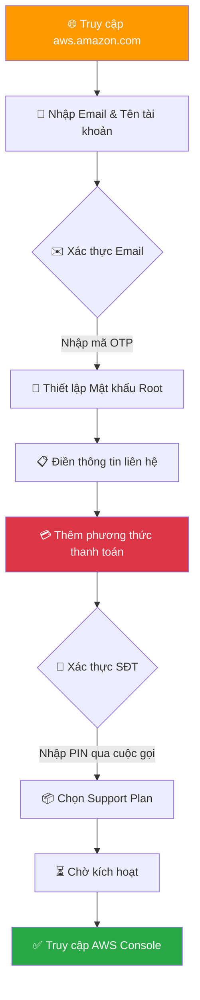
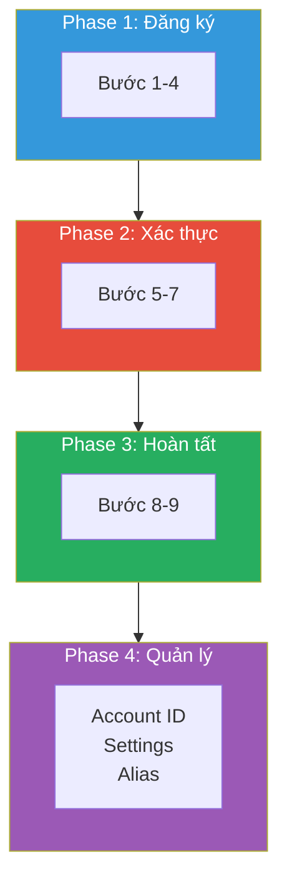
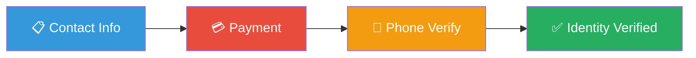
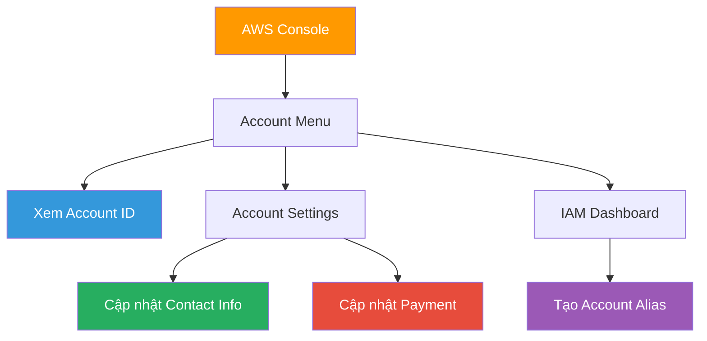

# AWS Account - Khởi tạo & Quản lý Tài khoản AWS

### 📌 Overview

- **Tạo tài khoản AWS miễn phí** từ A-Z với 9 bước chi tiết, tránh bị charge tiền không mong muốn
- **Quản lý tài khoản hiệu quả:** Xem Account ID, cập nhật thông tin, tạo Account Alias cho URL đăng nhập dễ nhớ
- **Áp dụng Best Practices 2025:** Bảo vệ Root User bằng MFA, thiết lập Billing Alert, và các nguyên tắc bảo mật quan trọng

### 🎯 Mục tiêu đạt được

- [ ]  Hiểu các khái niệm: AWS Account, Root User, Free Tier, Verification
- [ ]  Tạo thành công tài khoản AWS và đăng nhập Console
- [ ]  Biết cách xem Account ID và tạo Account Alias
- [ ]  Nắm vững 5 Best Practices bảo vệ tài khoản

---

## 🔗 Resources

| Loại tài nguyên (Type) | Nội dung (Content) |
| :--- | :--- |
| 📺 **Video hướng dẫn** | [1.Tạo Tài Khoản AWS Miễn Phí - Hướng Dẫn Chi Tiết Cho Người Mới](https://www.youtube.com/watch?v=fDhiEsKYiHY) |
| 🆓 **AWS Free Tier** | [Trang chủ AWS Free Tier](https://aws.amazon.com/free) |
| 🔗 **AWS Console** | [Link đăng nhập AWS Console](https://console.aws.amazon.com) |

---

## 📚 Knowledge Base

### 🔄 Tổng quan quy trình tạo tài khoản AWS



---

- 🏠 **AWS Account (Tài khoản AWS)**
    
    **Định nghĩa:** Container cao nhất chứa TẤT CẢ tài nguyên của bạn - servers, databases, networks, storage...
    
    **Ví dụ thực tế:** Giống như một ngôi nhà, AWS Account là toàn bộ căn nhà, còn các dịch vụ AWS (EC2, S3, RDS...) là đồ đạc bên trong.
    
    **Đặc điểm quan trọng:**
    
    - Mỗi account có một Account ID duy nhất (12 chữ số)
    - Billing được tính riêng cho từng account
    - Có thể tạo nhiều account cho các mục đích khác nhau (dev, staging, production)
- 👑 **Root User (Người dùng gốc)**
    
    **Định nghĩa:** Tài khoản đăng nhập bằng email đăng ký, có QUYỀN LỰC TỐI CAO và KHÔNG GIỚI HẠN trong account.
    
    **Quyền hạn đặc biệt (chỉ Root User mới làm được):**
    
    - Thay đổi thông tin account (tên, email, địa chỉ)
    - Đóng/xóa AWS account
    - Thay đổi Support Plan
    - Restore IAM user permissions
    - Cấu hình một số billing settings
    
    ⚠️ **CẢNH BÁO:** Không bao giờ dùng Root User cho công việc hàng ngày!
    
- 🆓 **AWS Free Tier (Gói miễn phí)**
    
    **3 loại Free Tier:**
    
    | Loại | Mô tả | Ví dụ |
    | --- | --- | --- |
    | **Always Free** | Miễn phí vĩnh viễn | Lambda: 1 triệu requests/tháng |
    | **12 Months Free** | Miễn phí 1 năm đầu | EC2 t2.micro: 750 giờ/tháng |
    | **Trials** | Dùng thử ngắn hạn | SageMaker: 2 tháng trial |
    
    💡 **Mẹo:** Luôn kiểm tra [AWS Free Tier page](https://aws.amazon.com/free) trước khi sử dụng dịch vụ mới
    
- 🔐 **Verification (Xác thực đa lớp)**
    
    AWS yêu cầu xác thực 3 lớp để đảm bảo danh tính thực:
    
    ```mermaid
    flowchart LR
        A["📧 Email"] --> B["💳 Thẻ thanh toán"]
        B --> C["📱 Số điện thoại"]
        C --> D["✅ Verified"]
        
        style D fill:#28a745,color:#fff
    ```
    
    **Chi tiết từng lớp:**
    
    1. **Email:** Mã OTP 6 chữ số gửi qua email
    2. **Thẻ thanh toán:** VISA/Mastercard hỗ trợ quốc tế, tạm giữ ~$1 USD
    3. **Điện thoại:** Cuộc gọi tự động với mã PIN 4 chữ số
- 🏷️ **Account Alias (Biệt danh tài khoản)**
    
    **Vấn đề:** URL đăng nhập mặc định rất khó nhớ:
    
    [`https://123456789012.signin.aws.amazon.com/console`](https://123456789012.signin.aws.amazon.com/console)
    
    **Giải pháp:** Account Alias cho phép thay thế Account ID bằng tên dễ nhớ:
    
    [`https://my-company.signin.aws.amazon.com/console`](https://my-company.signin.aws.amazon.com/console)
    
    **Yêu cầu Alias:**
    
    - Chỉ dùng chữ thường, số, dấu gạch ngang (-)
    - Phải duy nhất trên toàn hệ thống AWS
    - Độ dài: 3-63 ký tự
- 📦 **Support Plan (Gói hỗ trợ)**
    
    
    | Gói | Giá | Đối tượng | Response Time |
    | --- | --- | --- | --- |
    | **Basic** | Miễn phí | Học tập, cá nhân | Chỉ documentation |
    | **Developer** | $29/tháng | Dev/Test | < 24 giờ (business hours) |
    | **Business** | $100+/tháng | Production workloads | < 1 giờ (critical) |
    | **Enterprise** | $15,000+/tháng | Mission-critical | < 15 phút + TAM |
    
    💡 **Khuyên dùng:** Chọn **Basic** khi đang học, upgrade sau nếu cần
    

---

## 🛠️ Lab Guide: Tạo & Quản lý Tài khoản AWS

### 🗺️ Tổng quan các Phase



---

### 📋 PHASE 1: Khởi tạo & Khai báo định danh

**🎯 Mục tiêu:** Truy cập trang đăng ký và nhập thông tin cơ bản

**⏱️ Thời gian:** ~5 phút

### Bước 1: Truy cập trang đăng ký

- [ ]  Mở trình duyệt Chrome/Firefox (khuyên dùng Chrome)
- [ ]  Truy cập địa chỉ: [`https://aws.amazon.com`](https://aws.amazon.com)
- [ ]  Tìm nút **"Create an AWS Account"** màu cam ở góc phải trên
- [ ]  Click vào nút để bắt đầu

💡 **Tip:** Nếu không thấy nút này, click "Sign In to the Console" → "Create a new AWS Account"

---

### Bước 2: Nhập Email & Tên tài khoản

- [ ]  Nhập **Root user email address:**
    - Sử dụng email bạn kiểm tra thường xuyên
    - Email này dùng để khôi phục tài khoản
    - Ví dụ: [`your-email@gmail.com`](mailto:your-email@gmail.com)
- [ ]  Nhập **AWS account name:**
    - Đặt tên mô tả mục đích tài khoản
    - Có thể thay đổi sau
    - Ví dụ: `AWS Learning Account` hoặc `MyProject-Dev`
- [ ]  Click **"Verify email address"**

⚠️ **Lưu ý cho Business:** Nên dùng email distribution list như [`aws-root@company.com`](mailto:aws-root@company.com) thay vì email cá nhân nhân viên

---

### Bước 3: Xác thực Email

- [ ]  Mở hộp thư email đã đăng ký
- [ ]  Tìm email từ **Amazon Web Services** với tiêu đề "AWS Email Verification"
- [ ]  Copy mã xác nhận **6 chữ số**
- [ ]  Quay lại trình duyệt, dán mã vào ô yêu cầu
- [ ]  Click **"Verify"**

🔧 **Troubleshooting:**

- Không thấy email? → Kiểm tra thư mục **Spam/Junk**
- Vẫn không có? → Đợi 5 phút, click **"Resend code"**

---

### Bước 4: Thiết lập Mật khẩu Root User

- [ ]  Nhập mật khẩu mới theo yêu cầu:
    - ✅ Tối thiểu 8 ký tự
    - ✅ Có chữ hoa (A-Z)
    - ✅ Có chữ thường (a-z)
    - ✅ Có số (0-9)
    - ✅ Có ký tự đặc biệt (!@#$%...)
- [ ]  Xác nhận lại mật khẩu
- [ ]  Click **"Continue"**

💡 **Best Practice:** Sử dụng Password Manager (1Password, Bitwarden, LastPass) để lưu mật khẩu an toàn

---

### 📋 PHASE 2: Xác thực Danh tính

**🎯 Mục tiêu:** Hoàn thành xác thực thông tin liên hệ, thẻ thanh toán và số điện thoại

**⏱️ Thời gian:** ~10 phút



### Bước 5: Điền thông tin liên hệ

- [ ]  Chọn loại tài khoản:
    - ⭐ **Personal** - Khuyên dùng cho học tập, dự án cá nhân
    - 🏢 **Business** - Dành cho công ty, tổ chức
- [ ]  Điền đầy đủ các field:
    - **Full Name:** Họ và tên đầy đủ
    - **Phone Number:** Chọn +84 (Vietnam), nhập SĐT
    - **Country/Region:** Vietnam
    - **Address:** Địa chỉ của bạn
    - **City:** Thành phố (VD: Ho Chi Minh City)
    - **Postal Code:** Mã bưu chính (VD: 700000)
- [ ]  Tick ✅ vào ô **"I agree to the AWS Customer Agreement"**
- [ ]  Click **"Continue"**

---

### Bước 6: Thêm phương thức thanh toán

⚠️ **QUAN TRỌNG:** Đây là bước khiến nhiều người lo lắng. AWS SẼ KHÔNG charge tiền nếu bạn ở trong Free Tier limits!

- [ ]  Chuẩn bị thẻ **VISA** hoặc **Mastercard** hỗ trợ thanh toán quốc tế
- [ ]  Nhập thông tin thẻ:
    - **Card Number:** 16 số trên mặt trước thẻ
    - **Expiration Date:** Tháng/Năm hết hạn
    - **Cardholder's Name:** Tên in trên thẻ (VIẾT HOA)
    - **CVV/CVC:** 3 số mặt sau thẻ
- [ ]  Click **"Verify and Add"**

<aside>
⚠️

**Lưu ý về tạm giữ tiền:**

AWS sẽ tạm giữ **~$1 USD** (hoặc ~25,000 VNĐ) để xác minh thẻ hợp lệ.

Số tiền này sẽ được **HOÀN LẠI sau 3-5 ngày làm việc**.

</aside>

🔧 **Nếu thẻ bị từ chối:**

1. Liên hệ ngân hàng để mở khóa thanh toán quốc tế
2. Đảm bảo số dư > 30,000 VNĐ
3. Kiểm tra thẻ chưa hết hạn

---

### Bước 7: Xác thực số điện thoại

- [ ]  Chọn **Country/Region code:** Vietnam (+84)
- [ ]  Nhập số điện thoại (BỎ SỐ 0 ĐẦU)
    - Đúng: `912345678`
    - Sai: `0912345678`
- [ ]  Nhập mã **CAPTCHA** (Security check)
- [ ]  Chọn **"Text message (SMS)"** hoặc **"Voice call"**
- [ ]  Click **"Send SMS"** hoặc **"Call me now"**

**Nếu chọn Voice call:**

- [ ]  Nghe điện thoại từ AWS (số quốc tế)
- [ ]  Xem mã **PIN 4 chữ số** hiển thị trên màn hình máy tính
- [ ]  Nhập mã PIN vào bàn phím điện thoại
- [ ]  Chờ thông báo "Verification successful"

🔧 **Không nhận được cuộc gọi?**

- Kiểm tra lại mã vùng (+84)
- Tắt tính năng chặn cuộc gọi rác
- Thử lại sau 2-3 phút

---

### 📋 PHASE 3: Hoàn tất Đăng ký

**🎯 Mục tiêu:** Chọn Support Plan và chờ kích hoạt tài khoản

**⏱️ Thời gian:** ~2 phút (+ chờ kích hoạt)

### Bước 8: Chọn Support Plan

- [ ]  Xem qua các gói Support Plan:
    - ❌ Enterprise On-Ramp - $15,000+/tháng
    - ❌ Business - $100+/tháng
    - ❌ Developer - $29/tháng
    - ✅ **Basic Support - Free** ← CHỌN CÁI NÀY
- [ ]  Chọn **"Basic support - Free"**
- [ ]  Click **"Complete sign up"**

💡 **Tip:** Bạn có thể upgrade Support Plan bất cứ lúc nào sau này nếu cần

---

### Bước 9: Chờ kích hoạt & Đăng nhập

- [ ]  Thấy màn hình **"Congratulations!"** → Đăng ký thành công!
- [ ]  Kiểm tra email để nhận thông báo **"Welcome to Amazon Web Services"**
- [ ]  Click **"Go to the AWS Management Console"**
- [ ]  Đăng nhập với:
    - Email: Email đã đăng ký
    - Password: Mật khẩu đã tạo

<aside>
⏳

**Thời gian kích hoạt:**

- Thông thường: **Vài phút**
- Trường hợp đặc biệt: **Tối đa 24 giờ**
- Nếu > 24h: Kiểm tra email xem AWS có yêu cầu bổ sung giấy tờ không
</aside>

---

### 📋 PHASE 4: Quản lý Tài khoản

**🎯 Mục tiêu:** Học cách xem Account ID, cập nhật thông tin và tạo Account Alias

**⏱️ Thời gian:** ~5 phút



### Lab 4.1: Xem Account ID

- [ ]  Đăng nhập AWS Console
- [ ]  Nhìn góc **trên cùng bên phải** thanh navigation
- [ ]  Click vào **tên tài khoản/user** của bạn
- [ ]  Trong dropdown menu, tìm dòng **"Account ID: xxxx-xxxx-xxxx"**
- [ ]  Click icon **📋 Copy** để sao chép nhanh

**Khi nào cần Account ID?**

- Chia sẻ tài nguyên (Resource Sharing)
- Cấu hình Cross-Account Access
- Liên hệ AWS Support
- Điền form trong IAM Policies

---

### Lab 4.2: Cập nhật thông tin tài khoản

**A. Cập nhật Contact Information:**

- [ ]  Click tên tài khoản (góc phải trên) → **"Account"**
- [ ]  Cuộn xuống phần **"Contact Information"**
- [ ]  Click **"Edit"** bên cạnh mục cần sửa
- [ ]  Chỉnh sửa thông tin (Name, Address, Phone...)
- [ ]  Click **"Update"** để lưu

**B. Cập nhật Payment Method:**

- [ ]  Gõ **"Billing"** trong thanh tìm kiếm AWS Console
- [ ]  Chọn **"Billing and Cost Management"**
- [ ]  Trong menu bên trái, chọn **"Payment preferences"**
- [ ]  Để sửa thẻ hiện tại: Click **"Edit"** trên thẻ
- [ ]  Để thêm thẻ mới: Click **"Add payment method"**

⚠️ **Lưu ý:** AWS yêu cầu luôn có ít nhất 1 phương thức thanh toán hợp lệ

---

### Lab 4.3: Tạo Account Alias

- [ ]  Gõ **"IAM"** trong thanh tìm kiếm → Chọn **IAM**
- [ ]  Tại **IAM Dashboard**, nhìn sang cột **bên phải**
- [ ]  Tìm section **"AWS Account"**
- [ ]  Tìm dòng **"Account Alias"** → Click **"Create"** hoặc **"Edit"**
- [ ]  Nhập tên alias mong muốn:
    - Ví dụ: `my-company-name` hoặc `fcj-devops-lab`
    - Yêu cầu: chữ thường, số, dấu gạch ngang
    - Phải duy nhất trên toàn AWS
- [ ]  Click **"Save changes"**

**Test URL mới:**

- [ ]  Copy URL đăng nhập mới: [`https://your-alias.signin.aws.amazon.com/console`](https://your-alias.signin.aws.amazon.com/console)
- [ ]  Mở trình duyệt ẩn danh (Incognito)
- [ ]  Truy cập URL và verify hoạt động

**Bonus - AWS CLI Commands:**

```bash
# Tạo Account Alias
aws iam create-account-alias --account-alias your-alias-name

# Xem Alias hiện tại
aws iam list-account-aliases

# Xóa Alias
aws iam delete-account-alias --account-alias your-alias-name
```

---

## 💡 Quick Tips & Troubleshooting

### 🏆 5 Best Practices 2025 (BẮT BUỘC)

<aside>
1️⃣

**BẬT MFA CHO ROOT USER NGAY LẬP TỨC**

Đây là việc ĐẦU TIÊN phải làm sau khi đăng nhập. MFA bảo vệ tài khoản khỏi bị hack. Không có MFA = Tài khoản "naked" trên internet.

*Hướng dẫn: IAM → Security credentials → MFA → Activate MFA*

</aside>

<aside>
2️⃣

**KHÔNG DÙNG ROOT USER CHO CÔNG VIỆC HÀNG NGÀY**

Root User như siêu admin - quá nguy hiểm để dùng thường xuyên. Hãy tạo IAM User với quyền hạn phù hợp.

*Best practice: Chỉ dùng Root khi thực sự cần thiết (billing, close account...)*

</aside>

<aside>
3️⃣

**THIẾT LẬP BILLING ALERT**

Tạo alert khi bill vượt ngưỡng (VD: $5, $10, $20). Tránh bất ngờ với hóa đơn cuối tháng.

*Hướng dẫn: Billing → Budgets → Create budget*

</aside>

<aside>
4️⃣

**SỬ DỤNG EMAIL RIÊNG BIỆT (cho Business)**

Dùng email distribution list như [`aws-root@company.com`](mailto:aws-root@company.com) thay vì email cá nhân nhân viên. Tránh mất quyền truy cập khi nhân sự nghỉ việc.

</aside>

<aside>
5️⃣

**KIÊN NHẪN KHI KÍCH HOẠT**

Đừng đăng ký lại hoặc spam nút gửi mã nếu tài khoản chưa active. Chờ tối đa 24h. Hệ thống cần thời gian đồng bộ.

</aside>

---

### 🔧 Bảng xử lý lỗi thường gặp

| Lỗi | Nguyên nhân | Cách khắc phục |
| --- | --- | --- |
| ❌ Không nhận email OTP | Email vào Spam/Junk | Kiểm tra Spam, đợi 5 phút, click Resend |
| ❌ Thẻ bị từ chối | Không hỗ trợ quốc tế / Không đủ số dư | Liên hệ ngân hàng mở khóa, đảm bảo > 30K VNĐ |
| ❌ Không nhận cuộc gọi | Sai mã vùng / Chặn số lạ | Chọn +84, bỏ số 0, tắt chặn cuộc gọi rác |
| ❌ Tài khoản Pending | AWS cần xác minh thủ công | Kiểm tra email, cung cấp giấy tờ nếu yêu cầu |
| ❌ Màn hình vẫn hiện Sign Up | Tài khoản chưa kích hoạt | Bình thường, chờ email Welcome, tối đa 24h |

---

*📅 Cập nhật: Tháng 12/2025*