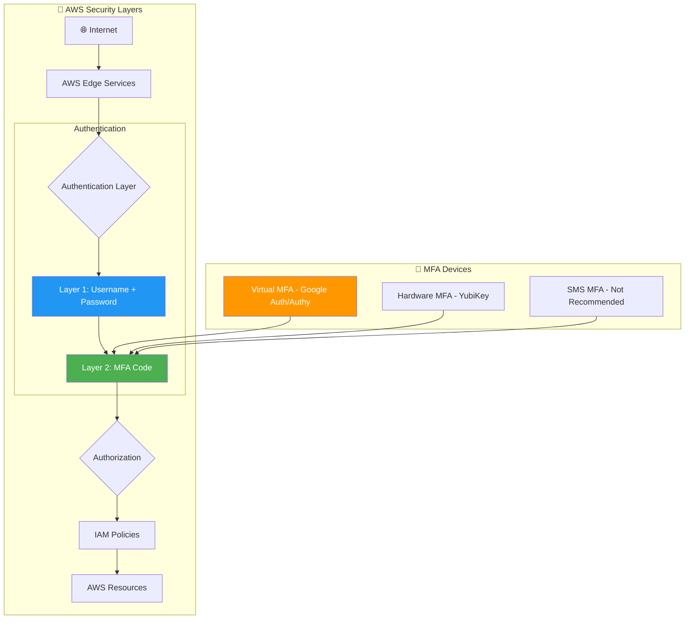
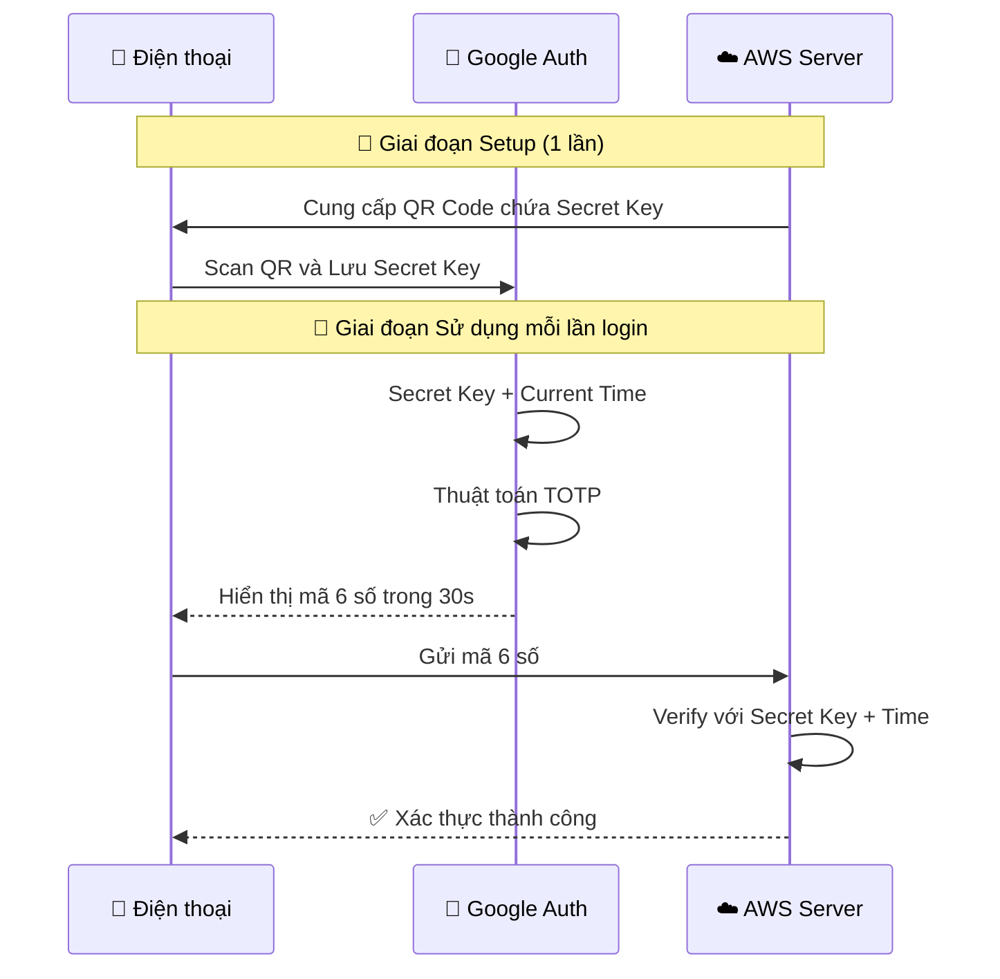
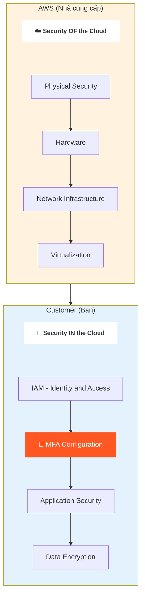
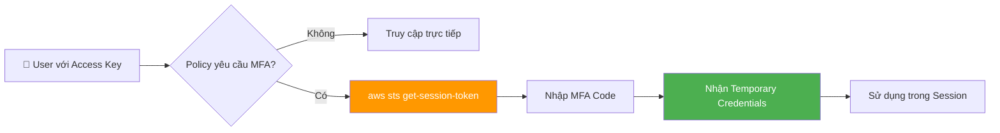
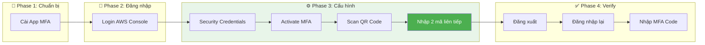
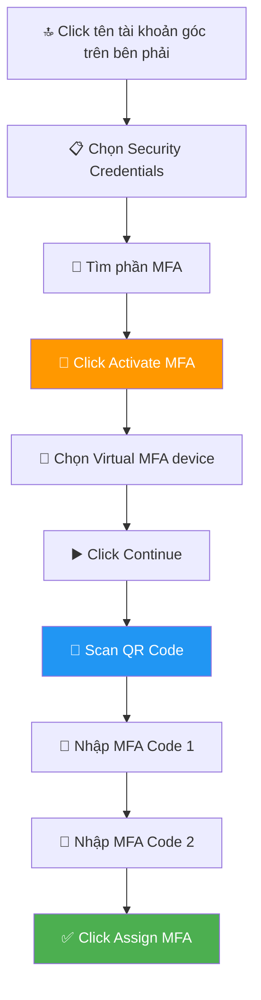

# MFA CHO TÀI KHOẢN AWS

### 📌 Overview

- **MFA (Multi-Factor Authentication)** là lớp bảo mật thiết yếu nhất, yêu cầu 2 yếu tố xác thực: mật khẩu (something you know) + mã từ thiết bị MFA (something you have).
- **Virtual MFA Device** (Google Authenticator, Authy) tạo mã TOTP 6 số, là giải pháp miễn phí và dễ triển khai nhất cho tài khoản AWS.
- **Root User** bắt buộc phải bật MFA ngay sau khi tạo tài khoản - đây là chốt chặn quan trọng nhất bảo vệ toàn bộ hạ tầng AWS.

### 🎯 Mục tiêu sau bài học

Sau khi hoàn thành, bạn sẽ có thể:

1. ✅ Hiểu nguyên lý hoạt động của MFA và tại sao nó quan trọng trong AWS Security
2. ✅ Cấu hình thành công Virtual MFA cho Root User và IAM User
3. ✅ Xử lý các lỗi thường gặp khi làm việc với MFA
4. ✅ Áp dụng best practices bảo mật MFA theo chuẩn AWS 2025

---

## 🔗 Resources

| Loại | Link | Mô tả |
| :--- | :--- | :--- |
| 📖 **AWS Docs** | [IAM MFA Documentation](https://docs.aws.amazon.com/IAM/latest/UserGuide/id_credentials_mfa.html) | Tài liệu chính thức AWS |
| 🔧 **Google Authenticator** | [iOS](https://apps.apple.com/app/google-authenticator/id388497605) / [Android](https://play.google.com/store/apps/details?id=com.google.android.apps.authenticator2) | App Virtual MFA phổ biến |
| 🔧 **Authy** | [Download](https://authy.com/download/) | App Virtual MFA hỗ trợ backup |
| 🔐 **YubiKey** | [Yubico Store](https://www.yubico.com/) | Hardware MFA (Bảo mật cao nhất) |

---

### 🏗️ Kiến trúc tổng quan - MFA trong AWS Security



---

### 🔑 MFA là gì? (Multi-Factor Authentication)

**Định nghĩa:**
MFA (Xác thực đa yếu tố) là cơ chế bảo mật yêu cầu **hai hoặc nhiều yếu tố** xác thực để truy cập tài khoản.

**Ba loại yếu tố xác thực:**

| Loại | Mô tả | Ví dụ |
| --- | --- | --- |
| **Something You Know** | Thông tin bạn ghi nhớ | Mật khẩu, PIN |
| **Something You Have** | Thiết bị bạn sở hữu | Điện thoại, Token vật lý |
| **Something You Are** | Đặc điểm sinh trắc học | Vân tay, Khuôn mặt |

**Tại sao cần MFA?**

```
🔓 Chỉ có Password:
   Hacker có password → Truy cập được tài khoản ❌

🔐 Có MFA:
   Hacker có password → Cần thêm MFA code → Không có device → Bị chặn ✅

```

**Analogy:** Password như chìa khóa cửa nhà, MFA như hệ thống báo động vân tay bên trong. Ngay cả khi mất chìa khóa, kẻ trộm vẫn không vào được nếu không có vân tay của bạn.

---

### 📱 Virtual MFA Device - Thiết bị MFA ảo

**Cơ chế hoạt động TOTP:**



**TOTP (Time-based One-Time Password):**

| Thuộc tính | Giá trị |
| --- | --- |
| Độ dài mã | 6 chữ số |
| Thời gian hiệu lực | 30 giây |
| Thuật toán | HMAC-SHA1 |
| Yêu cầu | Đồng bộ thời gian chính xác |

**So sánh các ứng dụng MFA:**

| Ứng dụng | Backup/Sync | Multi-device | Miễn phí |
| --- | --- | --- | --- |
| **Google Authenticator** | ❌ Không | ❌ Không | ✅ Có |
| **Authy** | ✅ Có | ✅ Có | ✅ Có |
| **Microsoft Authenticator** | ✅ Có | ✅ Có | ✅ Có |

> 💡 Khuyến nghị: Sử dụng Authy nếu muốn backup và đồng bộ nhiều thiết bị.
> 

---

### 🛡️ Shared Responsibility Model - Vị trí của MFA

**MFA thuộc trách nhiệm của ai?**



**MFA nằm trong "Security IN the Cloud"** - đây là trách nhiệm của khách hàng, không phải AWS.

> ⚠️ Quan trọng: AWS không thể bảo vệ tài khoản của bạn nếu bạn không tự bật MFA!
> 

---

### 👤 Root User vs IAM User - Ai cần MFA?

**So sánh Root User và IAM User:**

| Đặc điểm | Root User | IAM User |
| --- | --- | --- |
| **Quyền hạn** | Không giới hạn | Theo Policy được gán |
| **Email đăng nhập** | Email tạo tài khoản | Username được Admin tạo |
| **MFA bắt buộc?** | ✅ **BẮT BUỘC** | ✅ Khuyến nghị mạnh |
| **Sử dụng hàng ngày** | ❌ KHÔNG | ✅ CÓ |

**Nguyên tắc sử dụng:**

```
Root User:
├── ✅ Bật MFA ngay sau khi tạo tài khoản
├── ✅ Khóa/Xóa Access Keys
├── ✅ Chỉ dùng cho các tác vụ đặc biệt:
│   ├── Thay đổi gói Support
│   ├── Đóng tài khoản AWS
│   └── Khôi phục IAM User
└── ❌ KHÔNG dùng cho công việc hàng ngày

IAM User:
├── ✅ Tạo riêng cho từng người dùng
├── ✅ Yêu cầu bật MFA
├── ✅ Áp dụng Least Privilege
└── ✅ Sử dụng cho công việc hàng ngày

```

---

### 🔑 AWS CLI với MFA - Temporary Credentials

**Luồng xác thực CLI với MFA:**



**Lệnh cơ bản:**

```bash
# Kiểm tra danh tính hiện tại
aws sts get-caller-identity

# Lấy temporary credentials với MFA
aws sts get-session-token \
    --serial-number arn:aws:iam::ACCOUNT_ID:mfa/USER_NAME \
    --token-code 123456

# Response sẽ chứa:
# - AccessKeyId (tạm thời)
# - SecretAccessKey (tạm thời)
# - SessionToken
# - Expiration

```

> 📝 Lưu ý: Temporary credentials có thời hạn mặc định 12 giờ, tối đa 36 giờ.
> 

---

## 🛠️ Lab Guide (Thực hành chi tiết)

### 🎯 Mục tiêu Lab

Kích hoạt **Virtual MFA** sử dụng Google Authenticator hoặc Authy cho tài khoản AWS.

### 📋 Prerequisites

- [ ]  Tài khoản AWS đã được kích hoạt
- [ ]  Điện thoại thông minh (iOS hoặc Android)
- [ ]  Đã cài đặt Google Authenticator hoặc Authy

---

### 🔄 Luồng thực hành tổng quan



---

### 📱 Phase 1: Chuẩn bị thiết bị

- [ ]  **Bước 1.1:** Mở App Store (iOS) hoặc Play Store (Android)
- [ ]  **Bước 1.2:** Tìm kiếm "Google Authenticator" hoặc "Authy"
- [ ]  **Bước 1.3:** Tải và cài đặt ứng dụng
- [ ]  **Bước 1.4:** Mở ứng dụng và hoàn tất setup ban đầu (nếu có)

---

### 🔑 Phase 2: Đăng nhập AWS Console

- [ ]  **Bước 2.1:** Mở trình duyệt và truy cập https://console.aws.amazon.com
- [ ]  **Bước 2.2:** Chọn loại đăng nhập:
    - **Root user:** Nhập email tạo tài khoản
    - **IAM user:** Nhập Account ID + Username
- [ ]  **Bước 2.3:** Nhập mật khẩu và đăng nhập

---

### ⚙️ Phase 3: Cấu hình MFA (Quan trọng nhất)



### 1️⃣ Truy cập trang nạp MFA

- [ ]  **Bước 3.1:** Click vào **tên tài khoản** ở góc trên bên phải của Console
- [ ]  **Bước 3.2:** Chọn **"Security credentials"** từ dropdown menu
- [ ]  **Bước 3.3:** Scroll xuống tìm phần **"Multi-factor authentication (MFA)"**
- [ ]  **Bước 3.4:** Click nút **"Activate MFA"** (hoặc "Assign MFA device")

### 2️⃣ Thiết lập thiết bị

- [ ]  **Bước 3.5:** Trong popup hiện ra:
    - Đặt tên cho MFA device (ví dụ: `my-phone-authenticator`)
    - Chọn **"Authenticator app"**
    - Click **"Next"**
- [ ]  **Bước 3.6:** AWS hiển thị **QR Code** trên màn hình

### 3️⃣ Đồng bộ với điện thoại

- [ ]  **Bước 3.7:** Mở ứng dụng **Google Authenticator** hoặc **Authy** trên điện thoại:
    - Nhấn dấu **"+"** hoặc **"Add account"**
    - Chọn **"Scan QR code"**
    - Hướng camera vào QR code trên màn hình máy tính

### 4️⃣ Xác thực 2 bước (Bước quan trọng)

- [ ]  **Bước 3.8:** Sau khi scan thành công, app sẽ hiển thị mã 6 số liên tục thay đổi
- [ ]  **Bước 3.9:** Nhập mã 6 số hiện tại vào ô **"MFA code 1"** trên AWS Console
- [ ]  **Bước 3.10:** ⏳ **Đợi khoảng 30 giây** cho đến khi mã trên điện thoại đổi sang số mới
- [ ]  **Bước 3.11:** Nhập mã 6 số MỚI (khác mã 1) vào ô **"MFA code 2"**

> ⚠️ **LƯU Ý:** Bạn phải nhập 2 mã **khác nhau** và **liên tiếp** để AWS xác nhận bạn thực sự sở hữu thiết bị.

- [ ]  **Bước 3.12:** Click nút **"Add MFA"** hoặc **"Assign MFA"**
- [ ]  **Bước 3.13:** Xác nhận thông báo thành công: **"MFA device assigned successfully"** ✅

---

### 5️⃣ Kiểm tra đăng nhập (Bước cuối)

- [ ]  **Bước 4.1:** Click vào tên tài khoản → Chọn **"Sign out"**
- [ ]  **Bước 4.2:** Đăng nhập lại với Username và Password
- [ ]  **Bước 4.3:** AWS sẽ hiển thị form yêu cầu **nhập mã MFA**
- [ ]  **Bước 4.4:** Mở app Google Authenticator/Authy, lấy mã 6 số hiện tại
- [ ]  **Bước 4.5:** Nhập mã vào form và click **"Submit"**
- [ ]  **Bước 4.6:** ✅ **Thành công!** Bạn đã vào được AWS Console với lớp bảo mật MFA

---

### 🎉 Kết quả mong đợi

Sau khi hoàn thành lab:

| Checkpoint | Trạng thái |
| --- | --- |
| MFA Device được gán cho tài khoản | ✅ |
| Có thể đăng nhập với MFA | ✅ |
| App hiển thị tài khoản AWS | ✅ |
| Security credentials hiện "MFA: Active" | ✅ |

---

## 💡 Quick Tips & Troubleshooting

### 🔴 Lỗi 1: "MFA Code Invalid" (Mã không hợp lệ)

> Nguyên nhân: Thiết bị (điện thoại) bị lệch giờ so với máy chủ AWS.
> 
> 
> **Cách fix:**
> 
> 1. Vào **Settings** của app Google Authenticator
> 2. Chọn **"Time correction for codes"** hoặc **"Sync now"**
> 3. Đảm bảo điện thoại đang để chế độ **giờ tự động**
> 4. Thử lại sau 30 giây

---

### 🔴 Lỗi 2: Mất thiết bị MFA (Lost Device)

> Đối với IAM User:
> 
> - Liên hệ AWS Admin để reset MFA
> - Admin vào IAM Console → Users → [User name] → Security credentials → Deactivate MFA
> 
> **Đối với Root User:**
> 
> 1. Vào trang đăng nhập AWS
> 2. Click **"Forgot password"** hoặc **"Troubleshoot MFA"**
> 3. Xác thực qua email và số điện thoại đã đăng ký
> 4. AWS Support sẽ hỗ trợ reset MFA

---

### 🔴 Lỗi 3: Không đăng nhập được CLI với MFA

> Nguyên nhân: Đang dùng Access Key cố định cho tác vụ yêu cầu MFA.
> 
> 
> **Cách fix:**
> 
> ```bash
> # Lấy temporary credentials
> aws sts get-session-token \
>     --serial-number arn:aws:iam::123456789012:mfa/your-user \
>     --token-code 123456
> 
> # Export các credentials tạm thời
> export AWS_ACCESS_KEY_ID=ASIA...
> export AWS_SECRET_ACCESS_KEY=...
> export AWS_SESSION_TOKEN=...
> 
> ```
> 

---

### 🔴 Lỗi 4: Nhập 2 mã giống nhau khi setup

> Nguyên nhân: Không đợi mã mới xuất hiện.
> 
> 
> **Cách fix:**
> 
> - Mã MFA thay đổi mỗi 30 giây
> - **Bước 1:** Nhập mã hiện tại vào ô "MFA code 1"
> - **Bước 2:** **Đợi** cho đến khi mã mới xuất hiện (30s)
> - **Bước 3:** Nhập mã MỚI vào ô "MFA code 2"

---

### 🌟 Best Practices 2025

| Practice | Mô tả | Mức độ |
| --- | --- | --- |
| 🔐 **MFA cho Root User** | Bật ngay sau khi tạo tài khoản | **BẮT BUỘC** |
| 🔑 **Khóa Root Access Keys** | Xóa hoặc vô hiệu hóa | **BẮT BUỘC** |
| 👤 **Least Privilege** | Mỗi user có IAM riêng với quyền tối thiểu | Khuyến nghị |
| 📊 **CloudTrail** | Bật để giám sát mọi hành động đăng nhập | Khuyến nghị |
| 🔄 **IAM Roles** | Dùng cho EC2 thay vì Access Keys cứng | Khuyến nghị |
| 📱 **Backup MFA** | Sử dụng Authy để backup mã MFA | Khuyến nghị |

---

### 📋 Checklist bảo mật tài khoản AWS

- [ ]  Root User đã bật MFA
- [ ]  Root Access Keys đã xóa/vô hiệu hóa
- [ ]  Đã tạo IAM User cho công việc hàng ngày
- [ ]  IAM User đã bật MFA
- [ ]  CloudTrail đã được kích hoạt
- [ ]  Billing alerts đã được thiết lập
- [ ]  Password policy đã được cấu hình

---

## 📚 Tổng kết

### Key Takeaways

1. **MFA là bắt buộc** cho Root User - đây là bước bảo mật đầu tiên và quan trọng nhất
2. **Virtual MFA** (Google Authenticator/Authy) là giải pháp miễn phí, dễ triển khai
3. **TOTP** tạo mã 6 số mỗi 30 giây - yêu cầu đồng bộ thời gian chính xác
4. **Shared Responsibility Model**: MFA thuộc trách nhiệm của khách hàng (Security IN the Cloud)
5. **Least Privilege + MFA** = Nền tảng bảo mật vững chắc cho AWS
