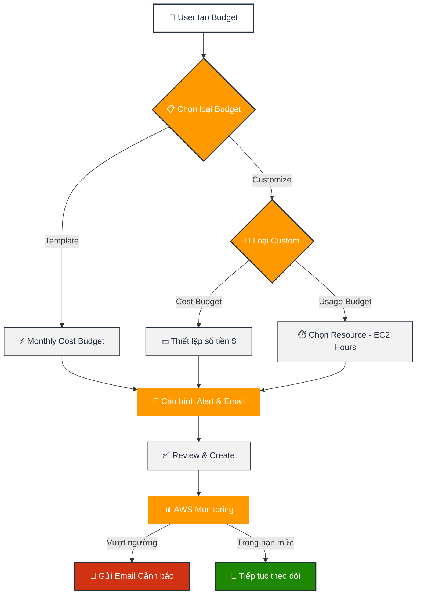
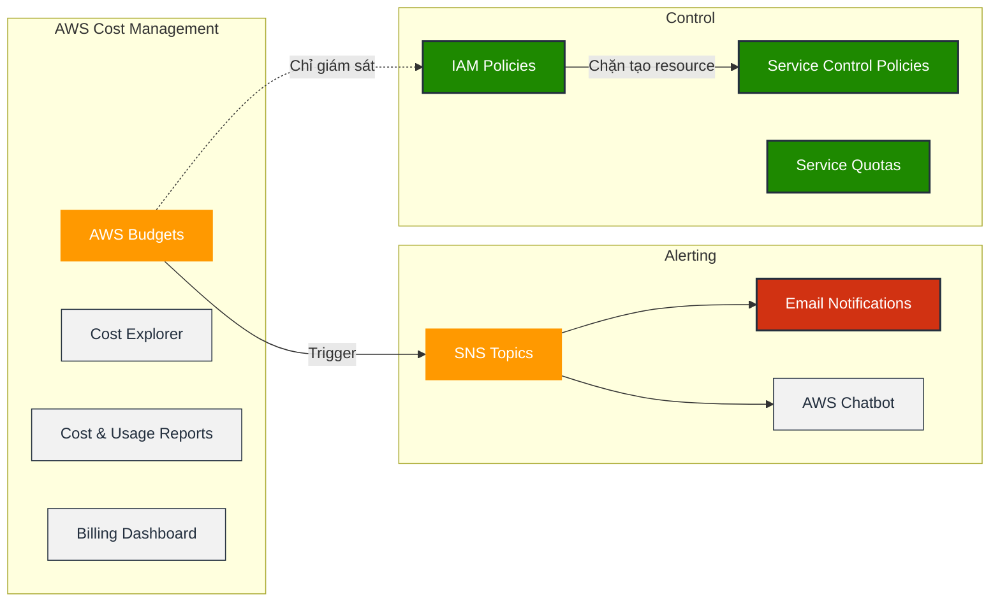
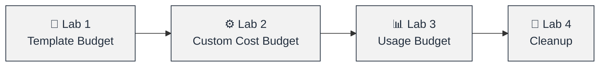
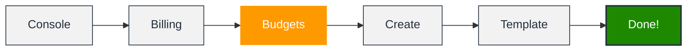
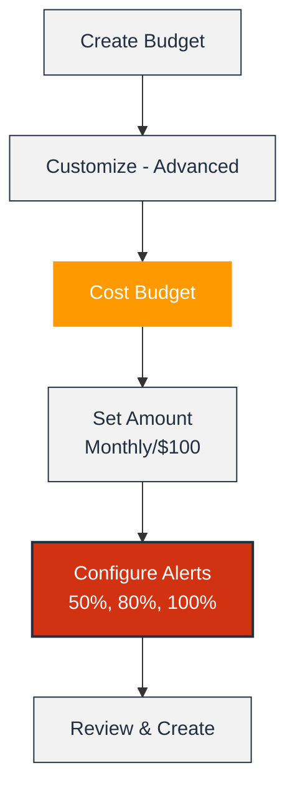
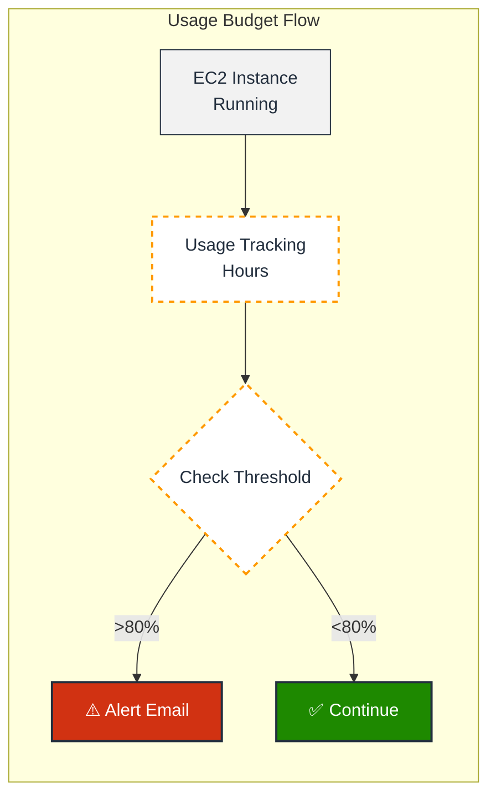
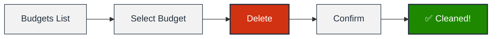

<a name="readme-top"></a>

# 💰 QUẢN LÝ CHI PHÍ VỚI AWS BUDGET
<div align="center">
  
</div>

### 📌 Overview

- **AWS Budgets** là công cụ thiết lập ngân sách tùy chỉnh để theo dõi chi phí và mức sử dụng tài nguyên AWS, gửi cảnh báo khi vượt ngưỡng.
- Hỗ trợ 2 loại chính: **Cost Budget** (theo dõi tiền $) và **Usage Budget** (theo dõi mức sử dụng như giờ chạy EC2).
- Là công cụ **giám sát và cảnh báo**, KHÔNG tự động dừng tài nguyên - cần kết hợp IAM/SCP để kiểm soát.

### 🎯 Mục tiêu sau bài học

- Hiểu sự khác biệt giữa Cost Budget và Usage Budget
- Tạo được Budget bằng Template và Customize
- Thiết lập cảnh báo đa ngưỡng (50%, 80%, 100%)
- Biết cách dọn dẹp Budget sau khi thực hành

---

## 🔗 Resources

| Loại | Link |
| --- | --- |
| 📺 **Video YouTube** | [3. AWS Budget Là Gì Hướng Dẫn Kiểm Soát Chi Phí AWS](https://www.youtube.com/watch?v=_3o1QjIhm10) |
| 📖 **AWS Docs** | [AWS Budgets Documentation](https://docs.aws.amazon.com/cost-management/latest/userguide/budgets-managing-costs.html) |
| 🧮 **Calculator** | [AWS Pricing Calculator](https://calculator.aws/) |

---

## 📚 Knowledge Base

### 🔄 Tổng quan Luồng hoạt động AWS Budgets



---

### 💡 AWS Budgets là gì?

Công cụ trong nhóm **AWS Cost Management** giúp thiết lập ngân sách tùy chỉnh để theo dõi chi phí và mức sử dụng. Gửi **alert** khi vượt quá hoặc được dự báo sẽ vượt ngưỡng.

**Đặc điểm quan trọng:**

- Chỉ **giám sát và cảnh báo**, KHÔNG tự động dừng tài nguyên
- Miễn phí **2 budgets đầu tiên**, các budget thêm có thể phát sinh phí nhỏ
- Dữ liệu billing có **độ trễ vài giờ đến 1 ngày**

---

### 💵 Cost Budget (Ngân sách chi phí)

Theo dõi chi phí dựa trên **số tiền (Dollar amount)**.

**Ví dụ:** Chi tiêu tối đa $100/tháng cho toàn bộ tài khoản.

**Khi nào dùng:**

- Kiểm soát tổng chi phí tài khoản
- Theo dõi chi phí theo từng dịch vụ cụ thể
- Dự báo chi phí cuối tháng

---

### ⏱️ Usage Budget (Ngân sách sử dụng)

Theo dõi **mức sử dụng** của tài nguyên cụ thể (giờ, GB, requests).

**Ví dụ:** Giới hạn 100 giờ chạy EC2/tháng để tránh quên tắt máy.

**Khi nào dùng:**

- Kiểm soát giờ chạy EC2, RDS
- Theo dõi dung lượng S3
- Giám sát số lượng API requests

> 💡 Pro Tip: Usage Budget phát hiện "quên tắt máy" NHANH HƠN Cost Budget vì không cần chờ hóa đơn tiền về!
> 

---

### 📋 Budget Template (Mẫu ngân sách)

Các cấu hình AWS định nghĩa sẵn cho trường hợp phổ biến:

| Template | Mô tả | Use Case |
| --- | --- | --- |
| **Zero Spend Budget** | Cảnh báo khi có bất kỳ chi phí nào | Tài khoản Free Tier |
| **Monthly Cost Budget** | Ngân sách chi phí hàng tháng | Kiểm soát chi tiêu định kỳ |

---

### 🏗️ Kiến trúc AWS Cost Management



---

### � IAM Permissions cho Budget

Để thao tác với Budget, user cần các quyền:

```json
{
  "Version": "2012-10-17",
  "Statement": [
    {
      "Effect": "Allow",
      "Action": [
        "budgets:ViewBudget",
        "budgets:ModifyBudget",
        "budgets:CreateBudget",
        "budgets:DeleteBudget"
      ],
      "Resource": "*"
    }
  ]
}

```

---

## 🛠️ Lab Guide

### 🔄 Tổng quan các Lab



---

### 🏃 Lab 1: Tạo Budget nhanh bằng Template

**🎯 Mục tiêu:** Tạo nhanh ngân sách theo dõi chi phí hàng tháng

**⏱️ Thời gian:** 5 phút



### Phase 1: Truy cập AWS Budgets

- [ ]  Đăng nhập **AWS Management Console**
- [ ]  Tìm kiếm dịch vụ **"Billing and Cost Management"** trong thanh search
- [ ]  Click vào **Budgets** từ menu bên trái

### Phase 2: Tạo Budget từ Template

- [ ]  Nhấn nút **"Create a budget"** (màu cam)
- [ ]  Trong phần **Budget setup**, chọn **"Use a template (simplified)"**
- [ ]  Trong phần **Templates**, chọn **"Monthly cost budget"**

### Phase 3: Cấu hình chi tiết

- [ ]  **Budget name:** Nhập `My-Monthly-Cost-Budget`
- [ ]  **Budgeted amount ($):** Nhập `100.00`
- [ ]  **Email recipients:** Nhập email nhận cảnh báo (ví dụ: `your-email@gmail.com`)

### Phase 4: Hoàn tất và Kiểm tra

- [ ]  Nhấn **"Create budget"**
- [ ]  Xác nhận budget mới xuất hiện trong danh sách
- [ ]  Kiểm tra trạng thái: **"Within budget"** (màu xanh)

> ✅ Kết quả mong đợi: Budget được tạo thành công, hiển thị trong danh sách với ngưỡng mặc định 80% và 100%
> 

---

### ⚙️ Lab 2: Tạo Cost Budget Tùy chỉnh (Customized)

**🎯 Mục tiêu:** Tạo ngân sách chi phí với thiết lập nâng cao

**⏱️ Thời gian:** 10 phút



### Phase 1: Khởi tạo Custom Budget

- [ ]  Tại màn hình **Budgets**, nhấn **"Create budget"**
- [ ]  Chọn **"Customize (advanced)"**
- [ ]  Chọn **"Cost budget - Recommended"**
- [ ]  Nhấn **"Next"**

### Phase 2: Thiết lập Ngân sách

- [ ]  **Period:** Chọn `Monthly`
- [ ]  **Budget renewal type:** Chọn `Recurring budget` (lặp lại hàng tháng)
- [ ]  **Budgeting method:** Chọn `Fixed` (cố định)
- [ ]  **Budgeted amount:** Nhập `100.00`
- [ ]  **Budget name:** Nhập `Custom-Cost-Budget-100USD`

### Phase 3: Chọn Phạm vi theo dõi

- [ ]  **Budget scope:** Chọn **"All AWS services (Recommended)"**
- [ ]  Nhấn **"Next"**

> 💡 Tip: Có thể chọn theo dõi từng service cụ thể (EC2, S3, RDS...) nếu cần
> 

### Phase 4: Cấu hình Cảnh báo Đa ngưỡng

**Alert 1 - Ngưỡng 50%:**

- [ ]  Nhấn **"Add an alert threshold"**
- [ ]  **Threshold:** Nhập `50`
- [ ]  **Trigger:** Chọn `Actual` (chi phí thực tế)
- [ ]  **Email recipients:** Nhập email

**Alert 2 - Ngưỡng 80%:**

- [ ]  Nhấn **"Add an alert threshold"**
- [ ]  **Threshold:** Nhập `80`
- [ ]  **Trigger:** Chọn `Forecasted` (dự báo)
- [ ]  **Email recipients:** Nhập email

**Alert 3 - Ngưỡng 100%:**

- [ ]  Nhấn **"Add an alert threshold"**
- [ ]  **Threshold:** Nhập `100`
- [ ]  **Trigger:** Chọn `Actual`
- [ ]  **Email recipients:** Nhập email

- [ ]  Nhấn **"Next"**

### Phase 5: Review và Tạo

- [ ]  Xem lại tất cả thông tin cấu hình
- [ ]  (Optional) Click **"Download template in JSON"** để lưu template
- [ ]  Nhấn **"Create budget"**

> ✅ Kết quả mong đợi: Budget với 3 ngưỡng cảnh báo (50%, 80%, 100%) được tạo thành công
> 

---

### 📊 Lab 3: Tạo Usage Budget (Theo dõi giờ chạy EC2)

**🎯 Mục tiêu:** Kiểm soát số giờ chạy máy ảo, tránh phát sinh chi phí ẩn

**⏱️ Thời gian:** 10 phút



### Phase 1: Khởi tạo Usage Budget

- [ ]  Tại màn hình **Budgets**, nhấn **"Create budget"**
- [ ]  Chọn **"Customize (advanced)"**
- [ ]  Chọn **"Usage budget"**
- [ ]  Nhấn **"Next"**

### Phase 2: Cấu hình Usage Type

- [ ]  **Budget name:** Nhập `EC2-Running-Hours-Budget`
- [ ]  **Usage type:** Click dropdown, chọn **"Usage type groups"**
- [ ]  Tìm và chọn **"EC2: Running Hours (Hrs)"**

### Phase 3: Thiết lập Giới hạn

- [ ]  **Period:** Chọn `Monthly`
- [ ]  **Budget renewal type:** Chọn `Recurring budget`
- [ ]  **Budgeted amount (Hrs):** Nhập `100` (100 giờ/tháng)
- [ ]  Nhấn **"Next"**

### Phase 4: Cấu hình Cảnh báo

- [ ]  Nhấn **"Add an alert threshold"**
- [ ]  **Threshold:** Nhập `80` (cảnh báo khi dùng 80% = 80 giờ)
- [ ]  **Trigger:** Chọn `Actual`
- [ ]  **Email recipients:** Nhập email
- [ ]  Nhấn **"Next"**

### Phase 5: Hoàn tất

- [ ]  Review thông tin
- [ ]  Nhấn **"Create budget"**

> ✅ Kết quả mong đợi: Usage Budget theo dõi EC2 running hours, cảnh báo khi vượt 80 giờ
> 

> 💡 Pro Tip: Usage Budget giúp phát hiện việc "quên tắt EC2" nhanh hơn nhiều so với chờ hóa đơn!
> 

---

### 🧹 Lab 4: Dọn dẹp Tài nguyên (Resource Cleanup)

**🎯 Mục tiêu:** Xóa budget thực hành để tránh nhận email spam

**⏱️ Thời gian:** 3 phút

> ⚠️ QUAN TRỌNG: Nếu chỉ thực hành Lab, hãy xóa budget để tránh nhận email rác!
> 



### Phase 1: Xóa các Budget đã tạo

- [ ]  Truy cập **Budgets** trong AWS Billing and Cost Management
- [ ]  Tích vào **checkbox** bên cạnh budget cần xóa (ví dụ: `My-Monthly-Cost-Budget`)
- [ ]  Nhấn nút **"Delete"** (hoặc Actions > Delete)
- [ ]  Trong hộp thoại xác nhận, nhấn **"Confirm"** hoặc **"Delete"**

- [ ]  Lặp lại cho các budget còn lại:
    - [ ]  `Custom-Cost-Budget-100USD`
    - [ ]  `EC2-Running-Hours-Budget`

### Phase 2: Xác nhận đã xóa sạch

- [ ]  Kiểm tra danh sách Budgets đã trống (hoặc chỉ còn budget production)

> ✅ Kết quả mong đợi: Tất cả budget thực hành đã được xóa, không còn nhận email cảnh báo
> 

> ⚠️ Lưu ý: Xóa Budget KHÔNG ảnh hưởng đến các tài nguyên đang chạy (EC2, S3...). Budget chỉ là lớp giám sát!
> 

---

## 💡 Quick Tips & Troubleshooting

### ⭐ Best Practices 2025

> 🎯 Thiết lập nhiều ngưỡng cảnh báo (Tiered Alerting)
> 
> 
> Đừng chỉ đặt một mức 100%! Hãy đặt:
> 
> - **50%:** Nắm tình hình giữa tháng
> - **80%:** Bắt đầu có kế hoạch điều chỉnh
> - **100%:** Khi đã chạm trần ngân sách

> 💡 Usage Budget cho tài nguyên tính giờ
> 
> 
> Với EC2, RDS - chi phí có thể tăng vọt nếu quên tắt. Usage Budget giúp phát hiện "quên tắt máy" nhanh hơn Cost Budget!
> 

> 🔐 Bảo mật thông tin tài chính
> 
> 
> Chỉ gửi cảnh báo đến Stakeholders/FinOps team có trách nhiệm. Tránh gửi lung tung để lộ thông tin nhạy cảm.
> 

> 🔗 Kết hợp với công cụ khác
> 
> 
> Budget chỉ giám sát! Để kiểm soát chặt, kết hợp với:
> 
> - **IAM Policies** - Giới hạn quyền tạo resource
> - **Service Quotas** - Giới hạn số lượng resource
> - **SCPs** - Kiểm soát ở cấp Organization

---

### 🔧 Troubleshooting - Lỗi thường gặp

| Vấn đề | Nguyên nhân | Cách khắc phục |
| --- | --- | --- |
| ❌ Không thấy Usage/RI Budget | Tài khoản AWS quá mới | Chờ một thời gian hoặc bắt đầu với Cost Budget trước |
| ❌ Budget không chặn tạo tài nguyên | Hiểu sai chức năng | Budget chỉ **giám sát**, không chặn. Dùng **IAM** hoặc **SCP** để chặn |
| ❌ Nhận quá nhiều email cảnh báo | Ngưỡng quá thấp/nhiều alert không cần thiết | Review lại ngưỡng, xóa budget sau khi Lab xong |
| ❌ Số liệu Cost/Usage không khớp | Độ trễ dữ liệu billing | Bình thường, dữ liệu có độ trễ **vài giờ đến 1 ngày**. Kiểm tra lại sau |

---

## ❓ FAQs

**Q1: Xóa AWS Budget có ảnh hưởng đến tài nguyên (EC2, S3) đang chạy không?**

> Không. Việc xóa AWS Budgets KHÔNG ảnh hưởng đến tài nguyên đang chạy. Budget chỉ là lớp giám sát, không kiểm soát lifecycle của resource.
> 

---

**Q2: Usage Budget dùng được cho những dịch vụ nào?**

> Usage Budget hữu ích cho các dịch vụ tính phí theo mức sử dụng:
> 
> - ⏱️ **Giờ chạy:** EC2, RDS, Redshift
> - 💾 **Dung lượng:** S3 storage (GB)
> - � **Requests:** API Gateway, Lambda invocations

---

**Q3: Tại sao tài khoản mới không thấy tùy chọn RI Budget?**

> Tài khoản mới thường bị giới hạn, chỉ thấy Cost Budget lúc đầu. Các tùy chọn nâng cao như RI Budget hoặc Savings Plans Budget sẽ khả dụng khi tài khoản có lịch sử sử dụng và thanh toán.
> 

---

**Q4: AWS Budget có tính phí không?**

> ✅ Miễn phí: 2 budgets đầu tiên💰 Có phí: Các budget thêm hoặc action nâng cao (Budget Actions)📖 Tham khảo: AWS Budgets Pricing
> 

---

**Q5: Làm sao để Budget tự động dừng EC2 khi vượt ngân sách?**

> Budget không thể tự động dừng tài nguyên. Để làm điều này, bạn cần:
> 
> 1. Sử dụng **Budget Actions** (tính năng nâng cao)
> 2. Kết hợp với **Lambda function** trigger từ SNS
> 3. Hoặc dùng **IAM Policies/SCPs** để ngăn tạo resource mới

---

## 📝 Ghi chú

> ⚠️ Disclaimer: Tài liệu này được tổng hợp cho mục đích học tập. Giao diện AWS có thể thay đổi theo thời gian. Luôn tham khảo AWS Documentation chính thức để có thông tin mới nhất.
> 

---

**📅 Cập nhật lần cuối:** December 2025

**👤 Tác giả:** PhuTV - AWS Learning Journey

> ⏩ **Next Lesson:** [4. AWS Identity and Access Management (IAM) Access Control](../4.%20AWS%20Identity%20and%20Access%20Management%20%28IAM%29%20Access%20Control)

<p align='right'>(<a href='#readme-top'>back to top</a>)</p>
