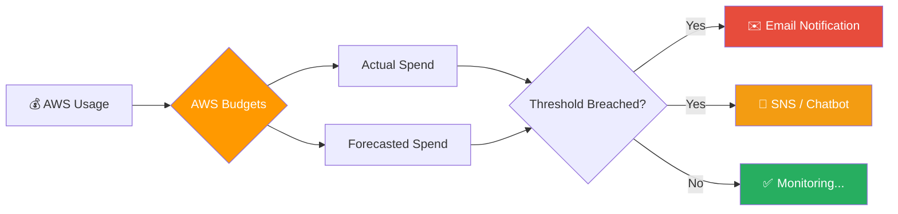

# QUẢN LÝ CHI PHÍ VỚI AWS BUDGETS

## 📌 Overview

- **AWS Budgets** là công cụ giúp bạn lập kế hoạch và kiểm soát chi phí AWS, cho phép thiết lập các ngưỡng cảnh báo (Alerts) khi chi phí thực tế hoặc dự báo vượt quá ngân sách.
- **Tiết kiệm chi phí (Cost Optimization):** Giúp bạn chủ động phát hiện các tài nguyên đang gây tốn kém và điều chỉnh kịp thời, tránh tình trạng "bill shock" cuối tháng.
- **Best Practices 2025:** Thiết lập nhiều tầng cảnh báo (50%, 80%, 100%) và kết hợp với AWS Chatbot để nhận thông báo qua Slack/Teams/Email.

### 🎯 Mục tiêu sau bài học

1. ✅ Hiểu cách AWS tính toán chi phí và tầm quan trọng của việc giám sát ngân sách.
2. ✅ Tạo thành công Zero-Spend Budget và Monthly Cost Budget.
3. ✅ Cấu hình thông báo qua Email khi chi phí chạm ngưỡng.
4. ✅ Nắm vững cách đọc biểu đồ chi phí cơ bản trong Billing Dashboard.

---

## 🔗 Resources

| Loại | Nội dung | Link |
| :--- | :--- | :--- |
| 📖 **AWS Docs** | AWS Budgets User Guide | [Link](https://docs.aws.amazon.com/awsaccountbilling/latest/aboutv2/budgets-managing-costs.html) |
| 💰 **AWS Calculator** | Công cụ ước tính chi phí | [AWS Pricing Calculator](https://calculator.aws/) |
| 📊 **Cost Explorer** | Phân tích chi tiết chi phí | [AWS Cost Explorer](https://console.aws.amazon.com/costmanagement/home) |

---

## 🏗️ Tổng quan quy trình hoạt động

## 🛠️ Lab Guide: Cấu hình AWS Budgets

### 📋 Phase 1: Tạo Zero-Spend Budget (Cảnh báo ngay khi phát sinh phí)

**Mục tiêu:** Nhận thông báo ngay lập tức nếu tài khoản của bạn phát sinh dù chỉ $0.01 chi phí (rất quan trọng cho Free Tier).

1. Truy cập **Billing and Cost Management** console.
2. Chọn **Budgets** ở menu bên trái.
3. Click **Create budget**.
4. Chọn **Use a template (simplified)**.
5. Chọn **Zero spend budget**.
6. Nhập email nhận thông báo.
7. Click **Create budget**.

### 📋 Phase 2: Tạo Monthly Cost Budget (Ngân sách hàng tháng)

... (Nội dung chi tiết sẽ được cập nhật)

---

*📅 Cập nhật: Tháng 12/2025*
