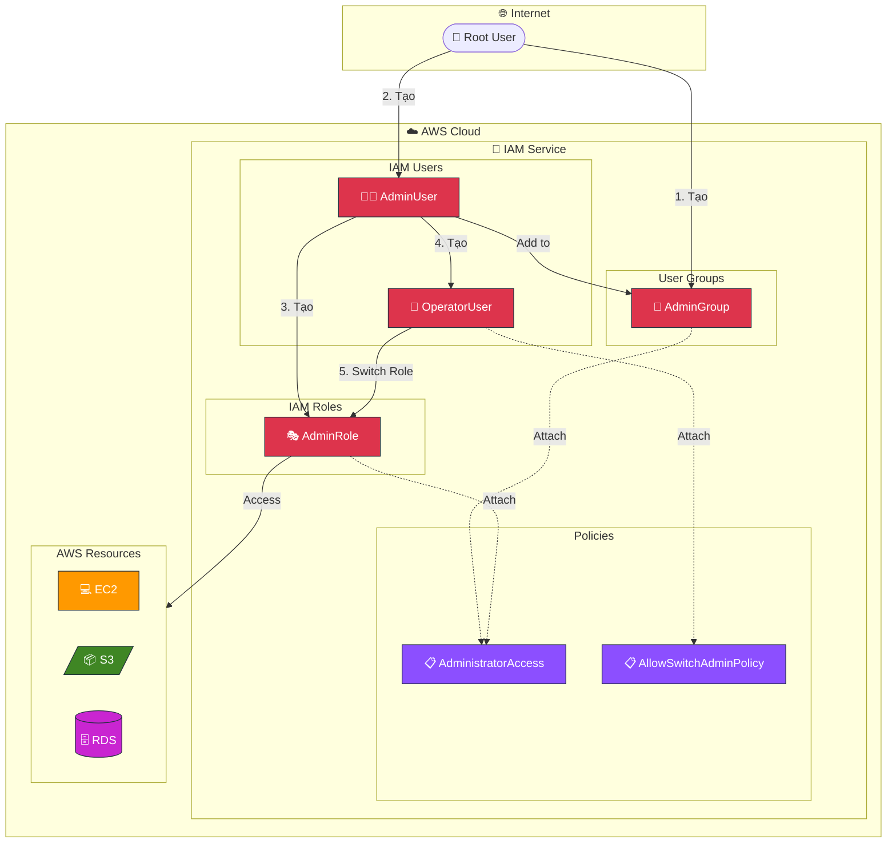
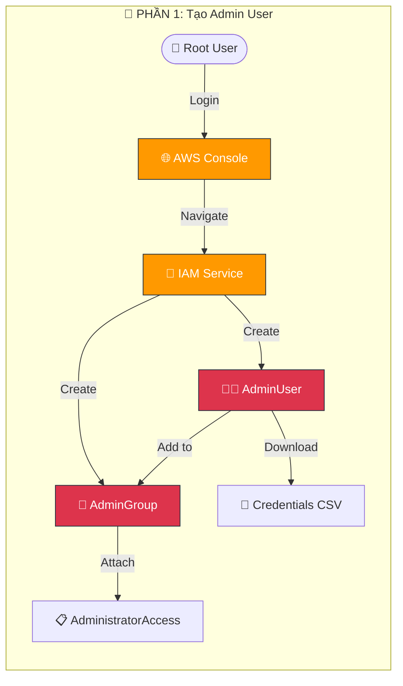
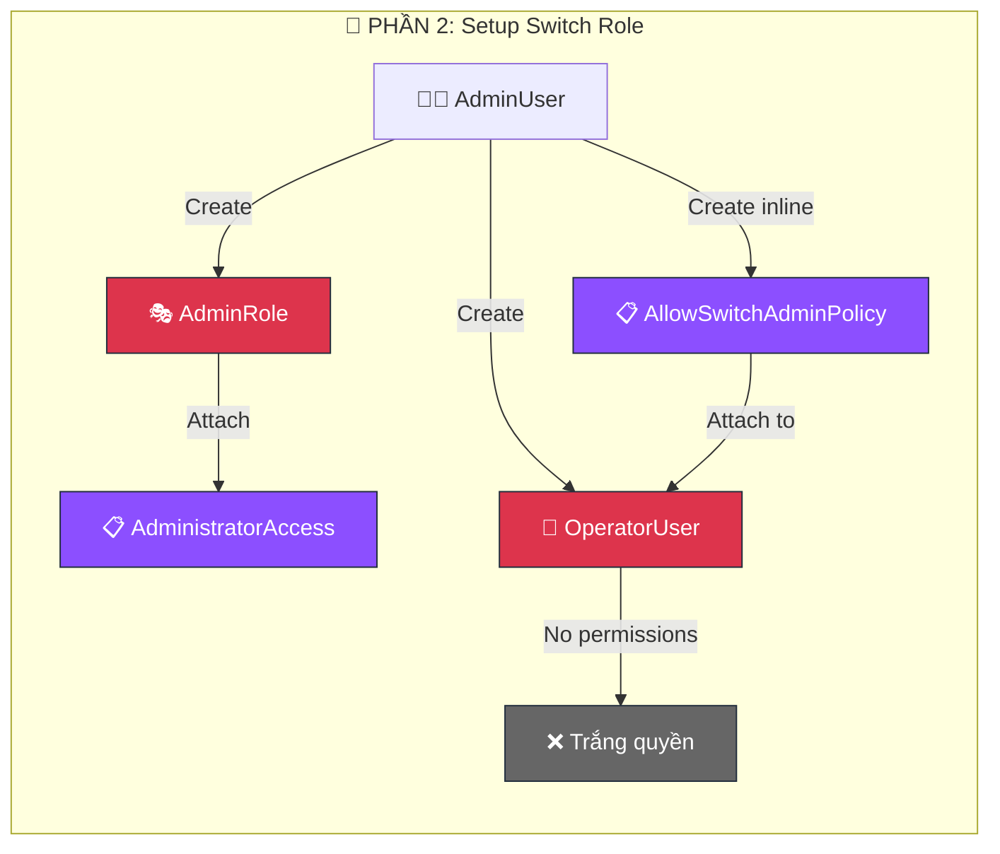
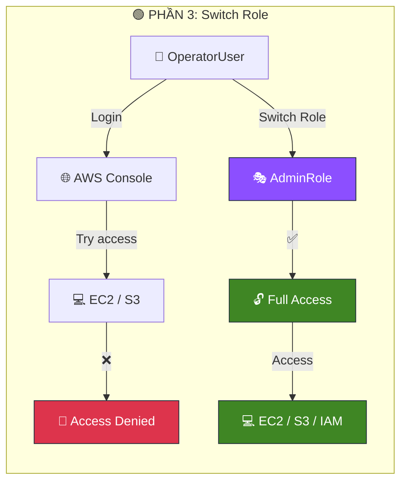
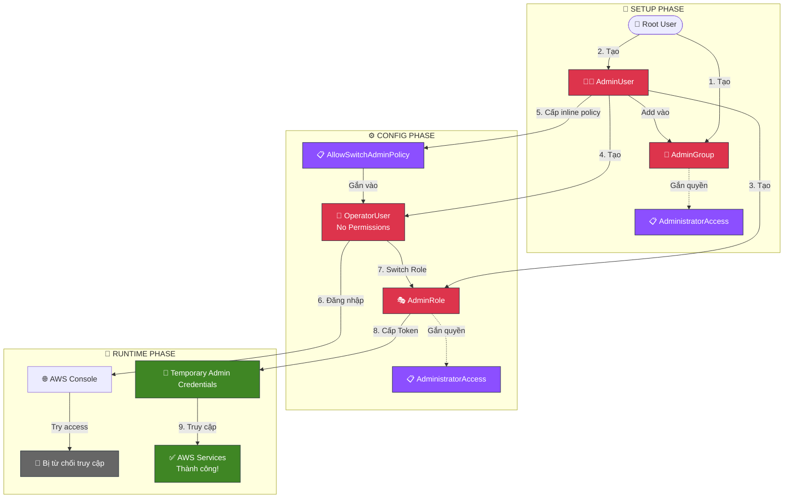

<a name="readme-top"></a>

# 🔑 Quản trị quyền truy cập IAM từ A-Z
<div align="center">
  
</div>

### 📌 Overview

- Thiết lập môi trường IAM chuẩn, **không dùng Root User** cho công việc hàng ngày
- Hiểu và thực hành kỹ thuật **Switch Role** để bảo mật tối đa
- Nắm vững nguyên tắc **Least Privilege** (Đặc quyền tối thiểu)

## Luồng chính:
Tạo Admin Group & User ➔ Tạo Role quyền lực (AdminRole) ➔ Tạo User hạn chế (OperatorUser) ➔ Cấu hình cho OperatorUser “mượn quyền” AdminRole

**Key Takeaway**: Luôn tuân thủ nguyên tắc Least Privilege và hạn chế dùng credential dài hạn.

---

### 🏗️ Architecture Overview



---

## 🔗 Resources

| Loại | Link |
| --- | --- |
| 📺 Video | [4. Hướng Dẫn AWS IAM Cho Người Mới Switch Role Tutorial](about:blank#) |
| 📖 AWS Docs | [IAM User Guide](https://docs.aws.amazon.com/IAM/latest/UserGuide/) |
| 📖 Best Practices | [Security Best Practices in IAM](https://docs.aws.amazon.com/IAM/latest/UserGuide/best-practices.html) |
| 🛠️ AWS Console | [IAM Dashboard](https://console.aws.amazon.com/iam/) |

---

## 📚 Knowledge Base

### 🔐 IAM Group (Phòng ban)

> Gom nhiều user vào một nhóm để cấp quyền một thể. User vào nhóm là tự động có quyền của nhóm.
> 

**Ví dụ thực tế:** Nhóm Admin, Nhóm Developer, Nhóm Tester - mỗi nhóm có bộ quyền riêng.

**Lợi ích:**

- Quản lý quyền tập trung
- Thêm/bớt user dễ dàng
- Không cần gán quyền từng người

---

### 👤 IAM User (Nhân viên)

> Định danh cụ thể của một người hoặc một ứng dụng. Có user thường và user có quyền admin.
> 

**Đặc điểm:**

- Credential cố định (username/password hoặc access key)
- Gắn với một danh tính cụ thể
- Có thể thuộc nhiều group

---

### 🎭 IAM Role (Chiếc mũ/Thẻ bài)

> Khác với User, Role không gắn chết vào ai. Nó là một tập hợp quyền hạn tạm thời. Ai “đội mũ” (assume role) thì có quyền đó trong thời gian ngắn.
> 

**Use cases:**

- EC2 instance cần truy cập S3
- Lambda function cần gọi DynamoDB
- User cần quyền admin tạm thời (Switch Role)
- Cross-account access

**Ưu điểm so với User:**

- Credential tạm thời (auto rotate)
- Không cần quản lý access key
- Bảo mật cao hơn

---

### 📋 IAM Policy (Bảng nội quy)

> Tờ giấy ghi rõ “Được làm gì” (Allow) và “Cấm làm gì” (Deny). Dán policy vào User/Role/Group nào thì đối tượng đó chịu tác động.
> 

**Cấu trúc Policy:**

```json
{
    "Version": "2012-10-17",
    "Statement": {
        "Effect": "Allow | Deny",
        "Action": "service:action",
        "Resource": "arn:aws:..."
    }
}
```

**Loại Policy:**

- **AWS Managed Policy:** Do AWS tạo sẵn (AdministratorAccess, ReadOnlyAccess…)
- **Customer Managed Policy:** Tự tạo, dùng lại được nhiều nơi
- **Inline Policy:** Gắn chết vào 1 user/group/role

---

## 🛠️ Lab Guide ⭐ QUAN TRỌNG NHẤT

### ✅ Prerequisites (Cần chuẩn bị)

- [ ]  Tài khoản AWS (đăng nhập bằng Root User email để khởi tạo)
- [ ]  Trình duyệt web (Khuyên dùng **Incognito** để tránh cache session cũ)
- [ ]  File text/Note để lưu: Account ID, User Name, Password, và Login URL

---

### 🔷 PHẦN 1: TẠO ADMIN USER (ĐỂ KHÔNG DÙNG ROOT)

**Mục đích:** Tạo một User có toàn quyền để quản trị, thay thế việc dùng tài khoản Root rủi ro cao.

### 📊 Flow Phần 1



### Bước 1: Tạo Admin Group

- [ ]  Đăng nhập AWS Console bằng Root User
- [ ]  Search “IAM” ➔ Chọn **User groups** ➔ **Create group**
- [ ]  Đặt tên group: `AdminGroup`
- [ ]  Phần **Attach permissions policies**, search và tick chọn `AdministratorAccess`
- [ ]  Bấm **Create group**

%20Access%20Control/image.png)

**Expected Result:** Group AdminGroup được tạo với quyền Full Access.

---

### Bước 2: Tạo Admin User

- [ ]  Menu trái chọn **Users** ➔ **Add users**
- [ ]  User name: `AdminUser`
- [ ]  ✅ Tick chọn **Provide user access to the AWS Management Console**
- [ ]  Chọn **I want to create an IAM user**
- [ ]  Chọn **Custom password** (đặt mật khẩu bạn nhớ)
- [ ]  ❌ Bỏ tick “Users must create a new password…” (để đỡ phiền lúc lab)
- [ ]  Bấm **Next**
- [ ]  Tại bước Set permissions, chọn **Add user to group** ➔ Tick chọn `AdminGroup`
- [ ]  Bấm **Next** ➔ **Create user**

⚠️ **QUAN TRỌNG:** Bấm **Download .csv file** hoặc copy **Console sign-in URL** và lưu lại ngay!

%20Access%20Control/image%201.png)

---

### Bước 3: Đăng nhập bằng Admin User

- [ ]  Đăng xuất Root User hoặc mở **trình duyệt ẩn danh mới**
- [ ]  Paste Console sign-in URL
- [ ]  Đăng nhập bằng `AdminUser` vừa tạo

**Expected Result:** Bạn đang ở trong AWS Console với tư cách AdminUser. **Từ giờ ta dùng user này để làm việc.**

---

### 🔶 PHẦN 2: THIẾT LẬP MÔ HÌNH SWITCH ROLE

**Mục đích:** Tạo tình huống thực tế - Một nhân viên vận hành (Operator) bình thường không có quyền gì cả, nhưng khi cần kíp có thể “biến hình” thành Admin.

### 📊 Flow Phần 2



### Bước 4: Tạo Role Admin (Chiếc mũ quyền lực)

- [ ]  Tại giao diện IAM (đang log bằng AdminUser), chọn **Roles** ➔ **Create role**
- [ ]  Chọn **AWS account** ➔ Chọn **This account**
- [ ]  Bấm **Next**
- [ ]  Phần Permission, search và chọn `AdministratorAccess`
- [ ]  Bấm **Next**
- [ ]  Đặt tên Role: `AdminRole`
- [ ]  Bấm **Create role**

%20Access%20Control/image%202.png)

⚠️ **Lưu ý quan trọng:**
- Click vào AdminRole vừa tạo
- Copy **ARN** (ví dụ: `arn:aws:iam::123456789012:role/AdminRole`)
- Nhớ kỹ **Account ID 12 số**

---

### Bước 5: Tạo Operator User (Nhân viên thường)

- [ ]  Vào **Users** ➔ **Add users**
- [ ]  User name: `OperatorUser`
- [ ]  Cấp quyền Console access và đặt mật khẩu như Bước 2
- [ ]  **QUAN TRỌNG:** Tại bước Set permissions, **KHÔNG chọn group hay policy nào cả**. Bấm **Next** luôn
- [ ]  Bấm **Create user** ➔ Lưu file .csv/mật khẩu

**Expected Result:** User được tạo nhưng “trắng” quyền.

---

### Bước 6: Cấp “Vé thông hành” cho Operator User

- [ ]  Vào danh sách **Users** ➔ Click vào `OperatorUser`
- [ ]  Tab **Permissions** ➔ **Add permissions** ➔ **Create inline policy**
- [ ]  Chuyển sang tab **JSON**
- [ ]  Copy đoạn code bên dưới và dán vào:

```json
{
    "Version": "2012-10-17",
    "Statement": {
        "Effect": "Allow",
        "Action": "sts:AssumeRole",
        "Resource": "arn:aws:iam::<ACCOUNT_ID>:role/AdminRole"
    }
}
```

- [ ]  **Thay thế `<ACCOUNT_ID>`** bằng 12 số Account ID của bạn
- [ ]  Bấm **Review Policy** ➔ Đặt tên: `AllowSwitchAdminPolicy`
- [ ]  Bấm **Create policy**

%20Access%20Control/image%203.png)

**Expected Result:** OperatorUser giờ có 1 quyền duy nhất: Được phép nhảy sang AdminRole.

---

### 🟢 PHẦN 3: THỰC HÀNH SWITCH ROLE (BIẾN HÌNH)

### 📊 Flow Phần 3



### Bước 7: Kiểm tra quyền hạn chế

- [ ]  Mở **trình duyệt ẩn danh mới**
- [ ]  Đăng nhập bằng `OperatorUser`
- [ ]  Thử vào dịch vụ **EC2** hoặc **S3**

**Expected Result:** Thấy lỗi đỏ lòm **“You need permissions…”** hoặc **“Access Denied”**.

%20Access%20Control/image%204.png)

> ✅ Chứng tỏ user này rất an toàn, không phá hoại được gì!
> 

---

### Bước 8: Thực hiện Switch Role

- [ ]  Click vào tên `OperatorUser` ở **góc trên cùng bên phải**
- [ ]  Chọn **Switch Role**
- [ ]  Nhập thông tin:
    - **Account:** 12 số Account ID của bạn
    - **Role:** `AdminRole`
    - **Display Name:** `AdminRole` (để dễ nhận biết)
    - **Color:** Chọn màu **Đỏ** (Cảnh báo quyền cao)
- [ ]  Bấm **Switch Role**

%20Access%20Control/image%205.png)

---

### Bước 9: Kiểm tra kết quả

- [ ]  Góc phải trên cùng giờ hiện tên **Admin nền đỏ**
- [ ]  Thử vào lại IAM hoặc S3

**Expected Result:** Truy cập mượt mà, full quyền. Bạn đang dùng quyền của Role tạm thời!

%20Access%20Control/image%206.png)

---

### 🧹 PHẦN 4: DỌN DẸP (CLEAN UP)

> ⚠️ Làm xong nhớ dọn để tránh rác tài khoản và bảo mật!
> 
- [ ]  Đăng xuất khỏi OperatorUser (hoặc **Switch back**)
- [ ]  Đăng nhập lại bằng **AdminUser** (hoặc Root)
- [ ]  Vào IAM và xóa theo thứ tự:
    - [ ]  Xóa Users: `OperatorUser`, `AdminUser`
    - [ ]  Xóa Groups: `AdminGroup`
    - [ ]  Xóa Roles: `AdminRole`
    - [ ]  Xóa Policy (nếu có tạo riêng ngoài inline)

---

## 💡 Tips & Best Practices 2025

> 💡 Stop using Root: Không dùng Root User cho công việc hàng ngày. Tạo IAM Admin User như Phần 1 để dùng.
> 

> 💡 MFA is Must: Bật xác thực 2 lớp (MFA) cho cả Root User và IAM User ngay lập tức.
> 

> 💡 Least Privilege: Chỉ cấp quyền vừa đủ. Đừng tiện tay gán AdministratorAccess cho mọi user. Dùng cơ chế Switch Role như bài lab này là chuẩn bài.
> 

> 💡 Use Roles for Apps: Nếu code chạy trên EC2 cần quyền truy cập S3, hãy gán Role cho EC2, ĐỪNG lưu Access Key/Secret Key trong code.
> 

---

## ⚠️ Troubleshooting

> ⚠️ Lỗi: Cannot switch role - Access Denied
> 
> 
> **Fix:** Kiểm tra lại inline policy của OperatorUser. Đảm bảo Account ID và Role name chính xác trong ARN.
> 

> ⚠️ Lỗi: Quên mật khẩu IAM User
> 
> 
> **Fix:** Đăng nhập bằng user có quyền Admin, vào IAM > Users > chọn user > Security credentials > Manage console password.
> 

> ⚠️ Lỗi: Không tìm thấy Console sign-in URL
> 
> 
> **Fix:** Vào IAM Dashboard, phần “AWS Account” ở bên phải sẽ hiển thị Sign-in URL cho IAM users.
> 

> ⚠️ Lỗi: Switch Role bị timeout
> 
> 
> **Fix:** Đây là behavior bình thường. Mặc định session là 1 giờ. Có thể chỉnh lên tối đa 12 giờ trong Role settings (Maximum session duration).
> 

---

## ❓ FAQs

**Q1: Tại sao phải tạo AdminGroup mà không gắn quyền thẳng cho AdminUser?**

A: Để dễ quản lý. Sau này công ty có thêm 10 ông Admin nữa, bạn chỉ cần add họ vào Group là xong, không phải đi gắn quyền cho từng người.

---

**Q2: Account ID lấy ở đâu?**

A: Bấm vào tên user ở góc trên cùng bên phải màn hình console, bạn sẽ thấy dãy số 12 chữ số. Bỏ dấu gạch ngang khi dùng trong JSON/ARN.

---

**Q3: Switch Role có bị timeout không?**

A: Có. Mặc định là **1 tiếng** (1 hour). Hết giờ bạn sẽ bị đá ra và phải switch lại. Có thể chỉnh lên tối đa **12 tiếng** trong cài đặt của Role.

---

**Q4: Inline Policy khác gì Managed Policy?**

A:

- **Inline Policy:** Gắn chết vào 1 user/group/role, không dùng lại được.
- **Managed Policy:** Policy độc lập, có thể gắn cho nhiều user/group khác nhau. Khuyến khích dùng Managed Policy cho dễ quản lý.

---

**Q5: Nếu mất file .csv chứa mật khẩu thì sao?**

A: Không xem lại được đâu! Bạn phải dùng tài khoản Admin để vào reset (đặt lại) mật khẩu mới cho user đó.

---

## 📊 Luồng hoạt động tổng quan



---

<!-- FOOTER_START -->
<br>
<div align="center">
  <b>AWS Cloud Journey</b>
  <br>
  <i>"Hành trình từ Zero đến Hero với AWS Cloud & DevOps"</i>
  <br><br>
  <a href="https://www.facebook.com/XueYongFu"></a>
  <a href="https://www.linkedin.com/in/tiet-vinh-phu-609173155/"></a>
  <a href="https://github.com/tietvinhphu/AWS-Journey"></a>
</div>
<!-- FOOTER_END -->

<p align='right'>(<a href='#readme-top'>back to top</a>)</p>
